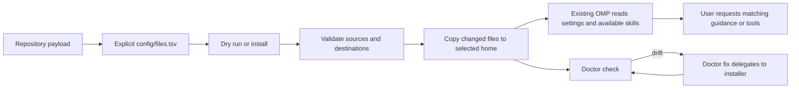

# omp-config

> **Safety:** This configuration deliberately sets `tools.approvalMode: yolo`, an unrestricted approval mode. Review this setting and its consequences before installing.

## Overview

`omp-config` is a portable, inventory-managed snapshot of user-level configuration and guidance for an existing OMP installation. It is not the OMP application, a plugin marketplace installer, or a project template. It does not include OMP or credentials, or start external services.

## Quick start

From the repository root. The source defaults to this checkout and the destination to your existing home (`$HOME` on POSIX, `%USERPROFILE%` in PowerShell). Preview first, then install.

```sh
sh install.sh --dry-run
sh install.sh
```

On Windows PowerShell (beta):

```powershell
.\install.ps1 -DryRun
.\install.ps1
```

After installation, open OMP and choose a prompt under [Start with your goal](#start-with-your-goal). For another home or source archive, see [Install and update](#install-and-update).

## What this configures

The managed payload has distinct runtime roles:

| Path | What it owns |
|---|---|
| `config/agent/PERSONALITY.md` | Global working, escalation, delegation and evidence-acceptance policy |
| `config/agent/AGENTS.md` | Conditional semantic routing and canonical permission distinctions |
| `config/agent/config.yml` | Native model/agent policy, approval mode, discovery, concurrency/depth and isolation settings |
| `config/agent/agents/` | Seven bounded role definitions, requested built-in tools and output contracts |
| `config/agent/extensions/` | Deterministic runtime restrictions and integrations; no worker-model router |
| `config/agent/skills/` | Passive on-demand procedures, selected by public `name:` |
| Task-specific plans and canonical project documents | Authorized project scope, interfaces, acceptance and maintained decisions; not global routing |
| `config/agent/commands/` | User-invoked command guidance; commands do not start services during installation |
| `config/agent/mcp.json` | MCP declarations that refer to machine-provided credentials and executables |
| `config/plugins/` | Plugin package/lock metadata; `pi-9router-ext` is deliberately disabled |
| `config/files.tsv` | Explicit allowlist mapping each managed source file to its home-relative destination |
| `scripts/` and `install.*` | Deployment checks, static configuration contracts and executable hook contracts |

## Skills, agents, extensions, and MCP

Keep these concepts separate at runtime:

- **Skills** are passive task guidance selected by public `name:` and read on demand. They do not grant a model, tool, or permission.
- **Agents** are bounded role definitions with instructions, requested built-in tool selection and output contracts. Their presence does not prove runtime discovery or dispatch, or universally exclude ambient tools.
- **Extensions** are event hooks or integrations. The retained model-dependent tool hook is not a reviewer sandbox, OS containment or a worker-model router.
- **Commands** are user-invoked guidance; the OpenDesign recipes are POSIX shell, not PowerShell commands.
- **MCP declarations** describe connections and prerequisites. They do not install or start servers.
- **OMP** continues to control session discovery, tool permissions, and approval behavior.

See [canonical permission distinctions](config/agent/AGENTS.md#permission-and-model-ownership) for instruction, built-in admission, native Plan Mode, extension interception, model policy, OS isolation and approval. Frontmatter is meaningful requested selection, not a universal sandbox; ambient tools and mutating LSP need scope discipline outside Plan Mode. Isolation remains disabled.

### Native worker-model ownership

Native OMP selects invocation model, then settings override, then agent frontmatter, then live parent/default. `@default` selects the live parent, not a fixed role. Alias resolution, unknown agents, invalid explicit selectors and credential fallback remain native behavior. Authentication fallback limits unconditional identity guarantees; static selectors are not dispatch evidence. See [version-matched discovery and precedence](https://github.com/can1357/oh-my-pi/blob/v18.6.1/docs/task-agent-discovery.md) and [native resolver](https://github.com/can1357/oh-my-pi/blob/v18.6.1/packages/coding-agent/src/config/model-resolver.ts).

| Agent | Native override | Configured model/thinking |
|---|---|---|
| scout | `@smol` | `openai-codex/gpt-6-luna:medium` |
| routine | `@routine` | `openai-codex/gpt-6-luna:medium` |
| task | `@task` | `openai-codex/gpt-6-luna:medium` |
| reviewer | `@task` | `openai-codex/gpt-6-luna:medium` |
| security-reviewer | `@task` | `openai-codex/gpt-6-luna:medium` |
| slow | `@slow` | `openai-codex/gpt-6.1-sol:medium` |
| advisor | `@advisor` | `openai-codex/gpt-6.1-sol:high` |

### Two paths, not a universal pipeline

**Ordinary native work:** direct Luna or a bounded existing worker, proportionate verification, done. No engineering-docs setup, delivery skill, baseline, manifest, extra approval or new document is required unless the actual boundary needs it.

**Documentation-dependent delivery:** available/enabled matching engineering-docs supplies material authoritative context; project-delivery handles new applications and explicit substantial/end-to-end delivery with whole-boundary readiness, native approval and affected-owner reconciliation. Context retrieval alone is not full delivery. Consequential plan review can apply independently without creating a baseline.

## Start with your goal

You do not need to run every skill. Choose the job that matches your need. These are OMP chat prompts, not terminal commands; replace examples with your project facts.

- **New project:** Use `project-delivery` to prepare the documentation baseline and complete implementation plan. Keep gaps explicit; do not write app code before native approval covers the reviewed scope. **First:** readiness gaps and a plan, not scaffolding.
- **Diagnose a bug:** Use `diagnosing-bugs` for the reported export-order failure despite passing library tests. Treat the report as ground truth; trace the real caller and propose a focused correction without editing or running commands. **First:** a source-grounded cause or remaining uncertainty.
- **Review changes:** Use `code-review` on staged, unstaged, and untracked work plus relevant requirements. Return separate Standards/correctness and Spec verdicts with file references; do not edit, test, publish, or approve. **First:** scoped findings and coverage limits.
- **Coordinate independent work:** Divide a feature into independent slices with shared interfaces, bounded ownership, and observable acceptance. Integrate and verify once; keep dependent work in sequence. **First:** isolated contributions or a reason to work serially.
- **Audit an existing UI:** Use `impeccable` to assess accessibility, keyboard use, narrow screens, and loading/empty/error states. Preserve the current brand and behavior; report findings only. **First:** scoped polish recommendations.
- **Load a handoff only:** Use `resume-from-handoff` to summarize the selected `.handoff` snapshot; do not inspect cited files, validate claims, run commands, edit, or continue. **First:** a snapshot summary or notice that none is available.

For every bundled choice, see [the full skill usage guide](SKILL-USAGE.md): **36 public names**, when to use each,
concrete prompts, expected outputs, permission/tool limits, and all **eight engineering-docs actions**.
Choose another skill only when its goal matches your task; these examples are alternatives, not a required sequence.

## Requirements and scope

- POSIX: `sh`, `awk`, `dirname`, `mkdir`, `rm`, `cp`, `cmp`, `mktemp`, and `date`. Remote ZIP installation additionally requires `curl` and `unzip`.
- Windows (beta): PowerShell 5.1+; remote ZIP installation uses `Invoke-WebRequest` and `Expand-Archive`.
- Not bundled: OMP, model credentials, Node.js, the OpenDesign daemon, the `rtk` executable, or herdr services. Every installed file is listed in the inventory.
- `config/agent/mcp.json` declares a GitHub HTTP MCP connection (`GITHUB_TOKEN`) and a local OpenDesign stdio connection (`OMP_OPEN_DESIGN_CLI`, `OD_DAEMON_URL=http://127.0.0.1:7456`). Configure these per machine; installation does not provide or start either server.
- The optional RTK and herdr hooks do not start services. The RTK hook disables itself unless `rtk >=0.23.0` is on `PATH`; `herdr` requires `HERDR_ENV=1`, `HERDR_SOCKET_PATH`, and `HERDR_PANE_ID`.
- `config/SKILL-SOURCES.md` documents the canonical skill folder, its source history, and licensing caveats. Skill snapshots do not guarantee downstream redistribution rights.

## Managed files

`config/files.tsv` is the explicit source-to-destination inventory shared by both installers and doctors:

- `config/agent/` maps to `~/.omp/agent/`; `config/plugins/` maps to `~/.omp/plugins/`.
- Managed skills have one source at `config/agent/skills/` and deploy to `~/.omp/agent/skills/` in flat `<folder>/SKILL.md` layout.
- Current counts: **233 mappings**, including **212 skill files** and **36 entrypoints with 36 unique public names**. The TSV is source metadata and is not installed. Existing homes retain obsolete native skills until separately authorized retirement; fresh-install catalog counts are not migration claims.

Managed skills use OMP's native user-skill convention. Native user/project skill discovery remains available, while the [managed discovery settings](config/agent/config.yml) leave `customDirectories` empty and disable Agents user/project skill-source discovery. Retired `.agent`/`.agents` copies cannot reenter through those configured sources. Other runtime providers may exist; these settings do not prove application-wide isolation.

## Install and update

The default source is this checkout. Destinations default to the existing `$HOME` on POSIX and `%USERPROFILE%` in PowerShell. To select another existing home and use a local source directory or ZIP URL, pass `--home`/`-Home` and `--source`/`-Source`:

```sh
sh install.sh --home '/path/with spaces' --source https://github.com/rizariaputrawira/omp-config/archive/refs/heads/main.zip
```

```powershell
.\install.ps1 -Home 'C:\Users\example' -Source 'https://github.com/rizariaputrawira/omp-config/archive/refs/heads/main.zip'
```

Remote ZIP archives must contain exactly one top-level directory, including hidden entries. Dry-run validates and reports intended changes without copying files or creating destination directories or backups. See [Requirements and scope](#requirements-and-scope) for platform prerequisites.

### Existing-home skill retirement

These 17 folders/public names are historical migration identifiers, not invocations or links to retained aliases. Installation is non-pruning: old native folders remain discoverable in existing homes until a separately authorized retirement moves them outside **all skill discovery roots**. Inspect and preserve customized contents first; do not blanket-delete directories. This task does not mutate a live home or claim 36-name discovery there.

| Retired folder under `.omp/agent/skills/` | Former public name | Surviving action/reference or removal |
|---|---|---|
| `emil-animate` | `emil-animate` | animate `build`: `skill://animate/references/build.md` |
| `emil-find-animation-opportunities` | `emil-find-animation-opportunities` | animate `opportunities`: `skill://animate/references/opportunities.md` |
| `emil-review-animations` | `emil-review-animations` | explicit review-animations: `skill://review-animations` |
| `find-animation-opportunities` | `find-animation-opportunities` | animate `opportunities`: `skill://animate/references/opportunities.md` |
| `animation-vocabulary` | `animation-vocabulary` | animate `vocabulary`: `skill://animate/references/vocabulary.md` |
| `taste-skill` | `taste-skill` | design-taste-frontend: `skill://design-taste-frontend` |
| `taste-skill-v1` | `design-taste-frontend-v1` | Exact v1 procedure removed; current selective `skill://design-taste-frontend`, not v1 compatibility |
| `gpt-tasteskill` | `gpt-taste` | Taste optional scroll: `skill://design-taste-frontend/references/scroll-storytelling.md` |
| `redesign-skill` | `redesign-existing-projects` | Impeccable workflow plus `skill://design-taste-frontend/references/redesign.md` |
| `brutalist-skill` | `industrial-brutalist-ui` | Taste opt-in industrial-print/tactical-crt: `skill://design-taste-frontend/references/style-directions.md` |
| `minimalist-skill` | `minimalist-ui` | Taste opt-in minimalist-editorial: `skill://design-taste-frontend/references/style-directions.md#minimalist-editorial` |
| `soft-skill` | `high-end-visual-design` | Taste opt-in high-end-editorial: `skill://design-taste-frontend/references/style-directions.md#high-end-editorial` |
| `ponytail-review` | `ponytail-review` | ponytail `review`: `skill://ponytail/references/complexity-review.md` |
| `ponytail-audit` | `ponytail-audit` | ponytail `audit`: `skill://ponytail/references/complexity-review.md` |
| `ponytail-debt` | `ponytail-debt` | ponytail `debt`: `skill://ponytail/references/debt-ledger.md` |
| `ponytail-help` | `ponytail-help` | ponytail `help`: inline `skill://ponytail` table |
| `ponytail-gain` | `ponytail-gain` | Removed uncited static scoreboard; no replacement or measured-saving claim |


The OpenDesign start/stop command guidance is user-invoked and POSIX-shell-specific. Set `OMP_OPEN_DESIGN_LAUNCHER` to an installed executable before running those commands; Windows installation does not provide a native PowerShell equivalent.

## Configuration doctor

Check is the default read-only mode and compares every inventory entry:

```sh
sh scripts/doctor.sh
sh scripts/doctor.sh --check --home /path/to/existing-home
sh scripts/doctor.sh --fix --home /path/to/existing-home
```

```powershell
.\scripts\doctor.ps1
.\scripts\doctor.ps1 -Check -Home 'C:\Users\example'
.\scripts\doctor.ps1 -Fix -Home 'C:\Users\example'
```

The doctor uses these exit codes:

- `0`: every mapped file matches.
- `1`: one or more files are missing or drifted.
- `2`: invalid arguments, inventory/home/read/compare errors, or repair failures.

`--fix` delegates once to the platform installer, then checks every file. Both POSIX entrypoints use the shared [inventory validator](scripts/validate-inventory.sh).

## How deployment and use fit together

The lifecycle is explicit inventory → validated install → existing OMP reads settings and available skills → optional doctor check. Installation copies only managed files; it does not install OMP, launch agents, activate the disabled plugin, or provide credentials.



- `config/files.tsv` defines the deployment boundary. Unlisted staging, credentials, caches, histories, and generated state are not installed.
- Installers validate the complete source/destination set before writing, create only directories needed by listed files, leave byte-identical files untouched, back up changed files with collision-safe names, and do not prune old or unrelated destination data.
- Doctor compares the same inventory; `--fix` delegates to the installer and checks again.

## Documentation-driven engineering suite

The documentation suite comprises fifteen skills and 109 regular assets deployed to `~/.omp/agent/skills/`. See [Managed files](#managed-files) for the complete inventory totals, layout and destination details.

`config/agent/AGENTS.md` routes conditionally; matching procedures are read on demand. The suite does not override OMP permissions or approval, and unavailable assets do not load themselves. See [SKILL-USAGE.md](SKILL-USAGE.md) for the public-name catalog and practical prompts.

## Selective OMO architecture comparison

The [OMO overview at `a8019016f47a9d814ebcc24bd921a561f065ee80`](https://github.com/code-yeongyu/oh-my-openagent/blob/a8019016f47a9d814ebcc24bd921a561f065ee80/docs/guide/overview.md) is a reference for principles, not a requirement to import prompts or machinery. OMP remains authoritative for this payload, with [v18.6.1 native agent contracts](https://github.com/can1357/oh-my-pi/blob/v18.6.1/docs/task-agent-discovery.md) and [Plan Mode child restrictions](https://github.com/can1357/oh-my-pi/blob/v18.6.1/packages/coding-agent/src/task/structured-subagent.ts).

| Reference concept | Local disposition |
|---|---|
| Main integration ownership | Already represented: main owns scope, integration and evidence acceptance. |
| Repository versus documentation research | Useful minimal scout enhancement, with versioned provenance; no librarian role. |
| Skill versus execution-role distinction | Useful documentation principle, already represented by composing passive procedures with bounded workers. |
| Independent plan review | Already represented; clarify review-only slow + plan-review and exact native local-plan access. |
| Evidence acceptance and plan-driven decomposition | Already represented; strengthen the seven-field packet and per-slice executor rationale. |
| Category routing, team/DAG framework, Boulder/persistent state, continuation loops and keyword routing | Unnecessary duplication for this configuration payload; no orchestration state or router added. |
| Architect/librarian/plan-consultant/plan-reviewer, extra plugin and model-prompt families | No distinct contract justifies more public roles, integrations or model taxonomy. Preserve seven roles and dormant plugin state. |
| Universal documentation/approval pipeline | Incompatible with ordinary lightweight native flow; documentation-dependent delivery remains conditional. |
| Cross-harness hard read-only/security claims | Uncertain without matching native evidence; do not import containment guarantees. |

## Verification scope

`python3 scripts/test_install.py` exercises the POSIX installer and doctor against isolated fixtures; it does not test PowerShell. `bun scripts/test_agent_config.mjs` parses real YAML/frontmatter and checks seven configured mappings plus deterministic negative cases; it is static configuration, not dispatch proof. `bun scripts/test_model_routing.mjs` and `node scripts/test_model_routing.mjs` invoke the real retained handler using native-shaped main/sub events and assert no slow/advisor spawn replacement. These are tool-handler contracts, not authenticated dispatch, native approval or OS containment.

### Native ownership verification (OMP 18.6.1)

The ownership change was exercised in disposable homes and native project fixtures, without installing to a real home:

- Static configuration contract passed for seven definitions and ten in-memory negative cases. The retained hook contract passed seven named groups under both Bun and Node; a native-shaped regression rejects the old slow/advisor `@task` replacement.
- POSIX installer/doctor integration passed all 233 mappings. Real-payload dry-run wrote no payload; install/check matched all destination bytes; an unrelated sentinel survived and identical reinstall preserved files/mtimes without unnecessary backups. Source validation found seven agents, 36 public skills, 233 regular payload assets/mappings, 163 local links and 96 live skill references with no broken target in the inspected owners.
- Native CLI `omp/18.6.1` child `session_init`, model and thinking records showed the five ordinary roles at Luna-medium, slow at Sol-medium and advisor at Sol-high, with no invocation selectors. Exact managed agent bodies were present in the dispatched system prompts. An explicit Luna-medium selector for slow resolved to Luna-medium. These are observed dispatch outcomes, not unconditional identity guarantees.
- Fresh ordinary direct and routine-probe sessions reported the exact sentinel without suite reads, baseline/manifest setup, mutation or extra approval. Explicit source-loaded documentation review returned the seven-field packet, identified missing denial/interface/readiness coverage and supplied a corrected draft with exact allowed/denied checks marked not run.
- Scout repository-only, documentation-only and mixed probes used substantive source reads and pinned version/section provenance. An unreachable source remained unknown with next evidence named. In interactive native Plan Mode, slow read the exact session-local draft and explicitly supplied plan-review/checklist; its actual tool list was read/grep/glob/web_search/yield with `readOnly=true`, no LSP/MCP/injected tools. It reported blockers without mutation/check execution/approval; the draft remained unapproved.

Complete native JSONL/session evidence was retained under `/tmp/omp-native-ownership-y41m1jt3/`, with parent-inspected metadata in `inspection.json`, `definition-provenance.json` and `plan-evidence-extract.json`. Deployment/source receipts are `/tmp/native-ownership-deployment-evidence.json` and `/tmp/native-ownership-source-evidence.json`. Independent read-only evidence reviews supported the bounded observations; a checker initially conflated a failed parent checklist path with the successful child read, then corrected it against exact records.

Limits remain explicit: initial empty-output launch attempts and an aborted noninteractive plan attempt are not proof. A parent misspelled-source read and reviewer/scout yield retries occurred; accepted child reads/results are preserved separately. Ambient GitHub/OpenDesign MCP initialization failed and those integrations were not validated. No app service or fixture implementation was launched, no plan was approved, and no OS containment was established. PowerShell/Windows remain unverified. Source-loaded procedure smoke is neither native skill registration nor comparative improvement or complete application delivery. Historical catalog evidence below remains historical.

### Balanced catalog verification

The 53-to-36 semantic simplification was checked against the explicit **233-mapping / 212-skill-file** payload:

- `python3 scripts/test_install.py` passed once for all 233 entries, exercising the production POSIX install/check/fix paths in disposable fixtures. `bun scripts/test_model_routing.mjs` passed its five named cases once.
- Native Bun YAML parsed exactly 36 public entrypoints and the three explicit-only declarations. Source checks covered complete asset inventory, local/skill links and headings, all 129 catalog concepts with 200 reference/template targets, and the seven engineering templates. The complete fifteen-skill engineering/security/handoff payload and full notices remained byte-identical. Impeccable's bundled assets and engine pin remained byte-identical outside its scoped entrypoint correction.
- A real disposable existing home passed dry-run with no payload writes, install, doctor check and exact inventory byte comparison. Installed OMP **18.5.0** reported exactly the 36 expected names through its passive unknown-name resolver diagnostic; the unsupported bare `skill://` read was not treated as discovery proof. Native reads resolved animate and the new vocabulary, Taste style and Ponytail debt references. Passive reads also retained the three explicit-only metadata declarations, not proof of enforcement.
- A second disposable home retained an obsolete native entrypoint and an unrelated file. Identical reinstall preserved all mapped bytes, modes and mtimes and created no needless backups. This demonstrates non-pruning, not completed migration of an existing user home.

Eight paired scenarios used sixteen fresh source-loaded consumers with equivalent isolated fixtures and recorded source maps, traces and complete terminal results. A fresh independent evidence judge assessed vocabulary, opportunities, motion review, motion audit, complexity/debt, Taste, images and harness proposals against fixed expectations. Candidate routing and report-only permission boundaries were supported within those scenarios; this is not candidate-only causation or general comparative improvement. No consumer trace recorded writes, command execution, launchers or services.

**Behavioral acceptance is partial, not a blanket pass.** Both initial image consumers correctly reported the unavailable generator and permitted supplied-image analysis, but described the reference geometry inaccurately. After adding guidance requiring verified geometry or explicit uncertainty, a fresh candidate-only reassessment still incorrectly described equal-height blocks as unequal. The independent judge therefore rejected image factual accuracy; prose policy did not establish fidelity, and no further source correction was justified by this evidence alone. Measurement or abstention is still required for such claims. Initial failures were retained, not replaced with a success claim.

Harness evidence also has limits: the baseline read an identical common-parent brief outside its assigned fixture; the candidate recovered from a failed relative-path read and consulted irrelevant in-fixture UI files, explicitly excluding them from its card conclusions. Neither rendered a member card or implemented a picker. Source-only Taste spacing proposals likewise are not observed visual results.

License handling is recorded in [provenance](config/SKILL-SOURCES.md#balanced-consolidation-and-licensing-boundary): existing notices are preserved, Ponytail includes its full upstream MIT notice, and new references with unclear legacy grants use independently authored guidance rather than transplanted prose. Existing legacy licensing caveats remain, so this is not blanket legal clearance.

No live home, model/agent/extension/MCP/plugin settings, installer or doctor was changed. No Impeccable/OpenDesign/Stitch engine, generator or external app service was launched. PowerShell/Windows execution remains unverified because neither runtime was available. Passive discovery and source-loaded consumer observations do not establish actual model dispatch identity, native Plan Mode/approval enforcement, OS containment, generated output quality or physical-device feel.


<details>
<summary>Detailed workflow, document ownership, standards, and skill capabilities</summary>

### Workflow at a glance

The labels name suggested owners for each phase, not a mandatory skill procession. Use specialist skills only when enabled, available and relevant; native approval and permission checks are not skills.


`project-delivery` owns this documentation-first gate for enabled, available new-app/substantial delivery and authorized continuation. `engineering-docs` selects/reuses canonical information and exposes due gaps. `brainstorming` resolves only consequential unknown choices; `domain-modeling` handles active terminology/ADRs; `plan-review` independently checks consequential multi-slice coverage before native approval. A disabled/unavailable suite is not auto-loaded or set up; ordinary native tasks remain possible, while explicitly requested unavailable suite-specific work stays incomplete.

The [single baseline procedure](config/agent/skills/project-delivery/references/documentation-baseline.md) defines readiness, changed-intent reapproval and complete affected-owner reconciliation. Before readiness, safe inspection and authorized document/design work can proceed, not app source/tests/scaffolding, dependency installation, migration or app-service startup. A feasible tracer or an `approved` string is not permission to bypass missing required app-level design/test intent. Native Plan Mode proposes substantive content without checkout writes. One native approval can cover the exact baseline and implementation plan; do not add another approval engine.

### Documents and timing

The logical baseline is required for gated delivery even when physical documents are combined or reused. Lean apps can use substantive README sections; larger apps split for real owners/audiences/lifecycles. Preserve established product/requirements/API/UI owners. Only if necessary information has no owner or convention use `docs/<family>/<canonical-id>.md`. No separate file per story, automatic whole-catalog bundle or fictional result document.

| Timing | Information and owner | Required coverage or applicability |
|---|---|---|
| Before development | Classification, profile, standards and index/manifest: `engineering-docs setup` | Record scope/risk/obligations, selected owners/anchors, relevant omissions, prerequisites, source basis and review. Reuse a sufficient valid index; otherwise authorized setup uses manifest v1 at `docs/engineering-docs.yaml`. Preserve/report invalid existing manifests rather than bypassing them. |
| Before development | Purpose/PRD or sufficient brief: product owner, project-delivery specification | Outcomes, users/stakeholders, scope/exclusions, sourced constraints and consequential assumptions; no duplicate BRD/PRD. |
| Before development | SRS, useful stories/use cases, acceptance, NFR and security/platform requirements: requirements owner | Testable success, denied/error/boundary behavior and justified quality targets/methods. Start security classification and requirements early. |
| Before development | Architecture, contracts, threat/control allocation and consequential decisions: architecture/native-contract owners | Relevant boundaries/responsibilities and data/trust flows; selected views only. Glossaries/ADRs and specialist outputs are applicability-based, not mandatory files. |
| Before development | Technical/API/UI design: detailed/native-contract and established visual owners | Data/state/error/concurrency/integration/platform invariants. Impeccable is primary where UI exists; OpenDesign generation only for an actual user/project requirement. Required unresolved UI baseline blocks this boundary's app implementation. Artifact TDD is not test-first. |
| Before development | Test strategy/plan/cases and trace: verification owner | Independent expected values, meaningful denial/boundary routes, safe data/environment, requirement-to-design/planned-proof links. Runtime results remain not-run, without invented implementation nodes or passes. |
| Before development | Applicable delivery/configuration/migration/rollback, operations/recovery and user preparation: release/operator/reader owners | Resolve implementation-affecting constraints and plan intended procedures/flows. No invented servers, service targets, deployment/restore/signing/store outcomes. |
| Before development | Baseline readiness and complete native implementation plan: project-delivery, conditional plan-review | Inspect all selected required content and review/gap dispositions. Trusted current authorization must cover exact material baseline decisions and plan; persist necessary reviewed docs after authorization and before app code. Repository plan mirror only for existing convention/team/portability need. |
| During development | Material intended changes: affected canonical owners and native plan | Update intended content, resolve conflicts and obtain required native reapproval before dependent code. Unchanged-intent corrections use existing scope. Invalidate only materially affected evidence. |
| During development | Actual verification/review/security findings and trace: existing evidence owners | Record only exercised checks and inspected findings/dispositions; unrelated green logs do not satisfy a failed criterion. Requested test-first, diagnosis and matching reviews are conditional, not a fifteen-skill procession. |
| Completion | Actual release/security/recovery/platform results, where required | Record observed outcomes only; missing required runtime/deployment proof stays unverified. Out-of-scope external events do not become invented requirements. |
| Completion | All affected as-built owners and user/app guide: project-delivery with engineering-docs maintain | Reconcile product/requirements, architecture/ADRs, design/native contracts, data/security/platform, verification/trace, release/configuration/recovery/operations and reader docs. A guide update alone is insufficient. Full completion needs every required criterion satisfied and complete affected-document reconciliation. |

### ISO standards mapped to the workflow

The standards below are voluntary reference points unless a project has an identified contractual, regulatory, organizational or certification obligation. They describe information and practices to consider; they do not require a fixed document set or prove conformity. Editions and applicability should be checked against the current official sources and recorded for the project. Names in the first column are common examples, not ISO-mandated titles; follow established project terminology and combine documents where appropriate.

<details>
<summary>Crosswalk of common document names, ISO references, and skill owners</summary>

| Common document name(s) | Workflow document / ISO reference | What the document is for | Skill(s) used in this step | Why use the skill |
|---|---|---|---|---|
| Document Register / Information Index / Project Management Plan | Lifecycle and information index — [ISO/IEC/IEEE 12207:2026](https://www.iso.org/standard/90219.html); [ISO/IEC/IEEE 15289:2019](https://www.iso.org/standard/74909.html); ISO/IEC/IEEE 15288:2015 (cited only by the 15289 public crosswalk) | 12207 gives software lifecycle process guidance and information roles. 15289 helps tailor information items to purpose, audience and process. Use an index/manifest to record selected owners, sources, applicability and gaps; combine documents when that serves their readers. | `/engineering-docs` (setup); `/project-delivery` | Engineering-docs selects and indexes only needed information; project-delivery governs readiness and the end-to-end delivery boundary. |
| PRD / BRD / FSD / SRS / User Stories / Use Cases / Acceptance Criteria | Product purpose, scope and requirements — [ISO/IEC/IEEE 29148:2018](https://www.iso.org/standard/72089.html) | Capture sourced needs, scope, constraints, useful use cases, acceptance criteria and verifiable requirements, including relevant error, denial and boundary behavior. | `/project-delivery` (specification); `/engineering-docs` (requirements); `/brainstorming` when consequential choices are unresolved | Project-delivery structures the product intent; engineering-docs maintains the requirements information; brainstorming explores consequential unknowns rather than inventing settled intent. |
| SAD / ADD / TSD / System Architecture Document / Interface Specifications / ADRs | Architecture description and decisions — [ISO/IEC/IEEE 42010:2022](https://www.iso.org/standard/74393.html) | Describe architecture from stakeholder concerns using only relevant views, interfaces, boundaries and decision rationale; it does not prescribe a mandatory diagram set. | `/engineering-docs` (architecture); `/domain-modeling` when terms or consequential decisions are unclear | Engineering-docs reuses or maintains architecture information; domain-modeling resolves ambiguous concepts and supports justified glossary/ADR decisions. |
| NFR Specification / Quality Requirements Specification / Quality Plan | Quality requirements — [ISO/IEC 25010:2023](https://www.iso.org/standard/78176.html); [ISO/IEC 25030:2019](https://www.iso.org/standard/72116.html) | Select product-relevant quality characteristics and turn them into measurable requirements with justified targets and assessment methods. | `/engineering-docs` (requirements); `/project-delivery` | Engineering-docs records applicable quality needs and their evidence; project-delivery ensures relevant requirements and proof are included in the reviewed baseline. |
| Test Strategy / Test Plan / Test Cases / Test Report | Test strategy, plan, cases and evidence — [ISO/IEC/IEEE 29119-1:2022](https://www.iso.org/standard/81291.html), [-2:2021](https://www.iso.org/standard/79428.html), [-3:2021](https://www.iso.org/standard/79429.html), [-4:2021](https://www.iso.org/standard/79430.html) | The parts cover testing concepts, processes, test documentation and techniques respectively. Select what fits the acceptance criteria and risk; plans are not execution results, and results require observed checks. | `/engineering-docs` (verification); `/tdd` only when test-first is explicitly requested; `/code-review` when review is needed | Engineering-docs maintains verification intent and trace; TDD supports an authorized test-first cycle; code-review evaluates an actual change against requirements and repository standards. |
| Security Requirements / Threat Model / Application Security Plan / ISMS documents (only if applicable) | Application security information — selected [ISO/IEC 27034-1:2011](https://www.iso.org/standard/44378.html) with Corrigendum 1:2014, [27034-2:2015](https://www.iso.org/standard/55582.html), [27034-3:2018](https://www.iso.org/standard/55583.html); [ISO/IEC 27001:2022](https://www.iso.org/standard/27001) with [Amendment 1:2024](https://www.iso.org/standard/88435.html) when applicable | The selected 27034 parts provide application-security guidance. 27001 concerns an organization's information-security management system only when that scope is actually adopted or required; neither reference alone demonstrates product security or certification. | `/engineering-docs` (security requirements and trace); `/security-review` or `/security-audit` only when in scope | Engineering-docs records applicable security concerns, controls and evidence owners; the specialists perform bounded review or audit work when the project risk and request call for it. |
| Software Quality Plan / Quality Management System Procedures (only if adopted) | Organization-adopted software quality-management scope — [ISO/IEC 90003:2018](https://www.iso.org/standard/74348.html) | Guidance for applying quality-management systems to software, relevant only where an organization has actually adopted that quality-management scope. It is not a project certification criterion by itself. | `/project-delivery`; `/engineering-docs` (setup) | Project-delivery coordinates the real organizational obligation with delivery readiness; engineering-docs records its source, applicability, owner and required evidence without claiming certification. |

</details>

**Edition caveat:** ISO/IEC/IEEE 15289:2019's public abstract maps information items to 12207:2017 and 15288:2015. Choosing 12207:2026 as lifecycle guidance does not establish an updated normative crosswalk. The cited ISO pages provide public metadata/abstracts; the normative texts were not assessed. See the [standards reference](config/agent/skills/engineering-docs/references/standards.md) for status, access limits and applicability notes.

**Practical prompt:** “Use project-delivery for this new application. Prepare and review the selected documentation baseline first. Do not implement until native approval covers the exact reviewed baseline and complete plan. After real verification, reconcile all affected documents before claiming completion.”

OMP owns operational state: native plan approval, optional todos, workers and same-session resume. Canonical docs own requirements and decisions; context packets are task/session aids, not another database. Delegation is optional and cannot replace readiness. Explicit pause/transfer may produce `.handoff/NNN-YYYYMMDD-handoff.md`; `resume-from-handoff` reads only the selected snapshot, while project-delivery resume chooses document work, remaining implementation, final reconciliation or no remaining work from actual evidence. A handoff/digest/label never approves execution. Source-loaded actions are distinct from native discovery, registration and Plan Mode/approval enforcement.

| Canonical skill | Concrete capability |
|---|---|
| /engineering-docs | Sole documentation owner: eight actions, source-first reuse, typed manifest, seven-heading context, trace/document audit and upgrade limits |
| /brainstorming | Approval paths, supplied-intent write-back and explicit ready-frontier stress-test |
| /domain-modeling | Active counterexamples, settled glossary and consequential truthful ADRs |
| /tdd | Meaningful observed vertical RED/GREEN and optional refactor; explicit test-first only |
| /code-review | Separate Standards/correctness and Spec verdicts, WIP coverage and complete fix dispositions |
| /diagnosing-bugs | Signal/minimization/falsifiable hypothesis/root correction/original-path proof |
| /writing-for-agents | Condition-bearing pointers, single owners and authorized real baseline/candidate assessment |
| /project-delivery | Reviewed whole-boundary baseline before code, complete vertical delivery, all affected-owner reconciliation and independently authorized resume; incumbent-first UI evidence |
| /plan-review | Read-only semantic acceptance, consumer integration, dependencies and proof coverage check |
| /handoff-to-another-harness | Explicit pause/export and transfer, exact partial state and non-authoritative portable snapshot |
| /resume-from-handoff | Selected-snapshot summary only, never continuation |
| /retro | Evidence/applicability/promotion conditions; no automatic policy/memory mutation |
| /security-intake | Source-only bundle purpose/authority/provenance/coverage assessment, exact four verdicts |
| /security-review | Focused changed-boundary discovery and fresh source refutation |
| /security-audit | Coverage-led audit with relevant AI, availability and supply-chain companions |

Exact immutable revisions, local path mappings, modifications and full MIT/Apache-2.0 notices are in each skill's SOURCES.md and [payload provenance](config/SKILL-SOURCES.md). Titus assets are not copied or translated because no covering grant was established. The Pi catalog shortlist (bigpowers 2.88.9, pi-security-analysis 0.17.3, pi-subagents 0.75.0, openwiki 0.7.0) is rejected for this bounded need, not certified safe/unsafe or assumed OMP-compatible. Its recorded necessity assessment is in engineering-docs/SOURCES.md.

Removed upstream behavior includes universal TDD, forced agents/model tiers, auto-commits/worktrees/ticket publishing, tracker/Context7/state engines, provider-specific tool aliases, fixed retry/confidence gates, fail-open filtering and universal security exclusions. OpenDesign is required only for explicitly required generation/refinement, not ordinary approved incumbent UI work. Existing independently owned UI routing remains.

</details>

<details>
<summary>Historical security reviews, skill migrations, and prior test results. These are records, not current verification.</summary>

### Security result and continuation boundaries

The security-reviewer retains its exact read-only tool list, `spawns: []` and `model: "@task"`. Its single native-style contract now requires coverage_summary, reviewed_paths and deferred, with candidates/decisions replacing findings/confidence. Discovery never assigns confirmation/severity; fresh refutation accounts for every assigned current root cause. Missing terminal arrays, IDs, independent proof, conditional confirmation fields or effective dispatched-definition provenance leaves the assessment incomplete. A role name, model identity or task-supplied schema alone is not managed-definition provenance. Read-only procedure/tool names are not OS isolation.

Handoff loading reads only its selected snapshot. Actual continuation belongs to project-delivery resume, reconciling canonical sources and exact approved bytes/scope with independently available trusted authorization. A mirror/hash/handoff label alone never authorizes execution. Export under read-only/Plan Mode returns unwritten proposed content.

### Compatibility evidence and upgrades

The earlier public `omp --version` and `omp --help` observations identified installed **18.5.0**. Help exposes `--config`, explicit file input and `--no-skills`. The user-invoked `omp --no-skills` disables skill discovery/loading, not AGENTS guidance, custom agents, tools or approval/model state. Conditional routing honors disablement and does not file-load around it. Recheck installed help before using that flag after an upgrade.

Payload/deployment, native discovery/task/custom-agent selection, and real tool-enabled behavior are independent checks. Current source parsing is not native dispatch proof; published moving documentation is not installed-version acceptance. Before the one-folder consolidation, public `omp read skill://<name>` resolved all fifteen then-deployed entrypoints in a disposable HOME/state, and an audit companion reference resolved there too. This historical result does not verify discovery after the current path/settings change. These are passive URI reads, not authenticated task/agent selection. Corrected fresh CLI generation with closed stdin exited 1 because no provider API key was available; the earlier piped-stdin attempt timed out. That startup also attempted the existing GitHub/OpenDesign MCP connections, which failed; it did not verify those services. Active credentials were not read or copied. At the user's request, the separate CLI-authentication item is closed using the already exercised authenticated current-session host actions and their actual model/tool/result evidence. This is an accepted verification path, not a passing fresh CLI generation result. Effective managed security-definition selection, native Plan Mode, malformed/overridden selection and disabled/unavailable native task cases remain unverified compatibility notes, not claimed passes or current blockers.

The user's deployment platform is WSL. Historical POSIX installer/doctor verification for the earlier cutover is complete, not final verification of this one-folder consolidation; Windows/PowerShell (beta) verification was closed as out of scope for that WSL-only acceptance. Neither PowerShell runtime was available, and no Windows execution is claimed. Verify the PowerShell entrypoints on an actual supported platform only if Windows deployment is later requested.

The old staging 13-smoke/ALL51/frozen test epoch is historical and does not accept this fifteen-skill suite. Recovery copies and assessment fixtures are external session evidence, never installed payload. Runtime settings, PERSONALITY.md, the boundary hook, installers/doctors and unrelated snapshots remain outside this cutover.

### Historical fifteen-skill cutover verification results

The production POSIX integration runner passed all 372 inventory entries; the unchanged model-routing runner passed its five named cases. Real disposable-home dry-run/install/doctor/repeat-install checks exercised source byte equality, zero dry-run mutation and repeat-install mtime/backup preservation. Metadata checks parsed all fifteen entrypoints using native Bun YAML, checked explicit asset/link coverage and full pinned notices, and checked all 129 frozen concept reference/template targets and heading anchors. One adopted security heading was corrected to retain its original frozen catalog target; the registry and seven templates were not changed.

The following are actual source-loaded private normal-host actions, not native registration, security-role selection or OS-containment proof. Completed implementation and assessment workers' runtime records recorded their assigned runtime settings and no fallback. Parent-owned process evidence is separate from workers' source observations.

The remaining verification was resumed with fresh actors, and a fresh independent reader judged all eighteen predefined smoke purposes supported with the stated bounds. This was bounded assessment-session acceptance, not a guarantee of every skill branch, exclusively candidate-caused behavior or unknown future-runtime compatibility. Matching runtime bootstrap guidance was also loaded in some actions: ponytail for coding, installed retro before the explicit copied retrospective procedure, and code-review for the independent evidence judge. Actual candidate procedures/references were separately read; these context qualifications are retained rather than claiming complete context isolation.

| Required behavior | Observed outcome and limits |
|---|---|
| CLI documentation setup and fresh rerun | Existing README and unrelated manifest owner preserved; typed manifest checked; fresh rerun made no changes. |
| Conflicting web authorization context and documentation audit | Both read-only actions retained competing owners, obsolete boundary, missing threat/operations evidence and unsupported remediation. Context supplied all seven headings; no severity invented. |
| Incomplete multi-slice plan | Read-only review identified omitted guest denial and missing CLI/API consumer integration with exact anchors. |
| Brainstorming stress-test | Inspected repository policy before asking the remaining ready refund choice; no implementation or documentation writes. |
| Active domain modeling | Used expiry/payment/cardinality counterexamples and settled glossary proposal; consequential ADR remained proposed, not falsely accepted. |
| Explicit TDD and ordinary-regression control | Observed two meaningful assertion failures before one combined correction/GREEN, then both passed; the test source was unchanged. Actual CLI success/denial paths passed. Separate ordinary request authored five passing regression cases without invoking TDD. Literal one-test-at-a-time RED/GREEN sequencing was not exercised and is not claimed. |
| WIP and fix review | Read actual WIP source, retained unknown Spec axis; fresh fix review addressed the original tenant issue and found newly introduced ordering breakage, read-only. |
| Reported CLI failure diagnosis | Treated report as ground truth; working-library discriminator isolated consumer bypass. Corrected only consumer, exercised exact permitted/denied CLI and passed three consumer regressions; no confirmation-only replay. |
| Normal two-slice delivery | Read all six delivery references, mapped acceptance to producer/consumer proof and independently dispositioned supplied feedback. Waited for actual library proof before consumer implementation; actual CLI paths then passed. Incomplete worker report was not accepted as evidence. |
| Guidance baseline/candidate assessment | Separate actual authors and fresh consumers preserved the existing owner and followed conditional pointers. Both controls succeeded; no invented baseline failure or improvement. Parent checked writes, source preservation and actual CLI behavior. A fresh independent reader inspected actual source/tool/result evidence and supported the bounded comparison; no comparative improvement or negative-trigger comparison is inferred. |
| Pause/export and read-only export control | New numeric snapshot preserved the previous one, contained the exact six headings and honest partial state; receiving prompt reconciled current authority. Separate control returned unwritten content with no writes. Native Plan Mode remains unverified. |
| Load-only handoff | Read only entrypoint, directory and selected snapshot; did not inspect cited sources or execute its “already approved” instructions. |
| Supported versus unsupported continuation authority | Current exact-scope parent assignment supported ordered reconstruction and CLI-only continuation; producer/snapshot preserved and actual CLI paths passed. A fresh unsupported-assertion action returned all seven headings, treated mirror/hash/handoff as content rather than permission, withheld continuation and left the fixture unchanged. The earlier quota-failed job remains historical failure, not merged proof. |
| Retrospective | Fresh action read the copied procedure/reference and real completed-slice process/test receipts, produced evidence/applicability/revisit conditions and rejected the unsupported universal wiki lesson; no policy/memory mutation. Matching installed-retro bootstrap was also read, so the actor's exclusive-copied-source wording is qualified externally; no recurrence or candidate-only attribution is claimed. |
| External bundle intake | Actual read-only discovery inventoried inert text/manifest and reported unsafe purpose/authority mismatch with missing binary/extension coverage. The earlier quota failure and a resumed refuter's nonmatching installed-code-review read remain recorded failures. A distinct fresh recheck loaded copied intake first, independently inventoried/read current sources and returned the same assigned root as needs-validation without severity; fixture unchanged and no target execution/install/network/credential/write/delegation attempt. Unsafe adoption posture is not a confirmed runtime exploit. |
| Focused tenant-gate review/refutation | Actual read-only discovery and distinct fresh refuter independently read imported gate; seeded gate-removal allegation rejected on complete scoped source disproof, no severity. Runtime/native-definition assurance remains unverified. |
| Explicit partial security audit | Discovery plus distinct fresh refutation/coverage challenge considered AI, availability and supply-chain boundaries. Local authorization omission retained as needs-validation because caller/deployment/model facts are missing; no severity or whole-app assurance. |
| Malformed/lifecycle-invalid terminal results | Fresh semantic action read all nine invalid cases and accounted for each exactly once. Missing phase arrays/IDs, conflicting or unassigned dispositions, missing confirmation proof, unproved authorized-local, prohibited severity and failed fragments all withheld confirmation/clean assurance, retaining assigned unresolved IDs. This is observed source-loaded semantic assessment, not production native-parser validation. |

Complete published host security terminals were checked for assigned IDs, phase completeness and semantic dispositions; a task-supplied schema and same-named role still do not prove effective managed-definition provenance. Failed/intermediate yields and a schema-validation override in the fresh intake trace are retained, not promoted to native strict-enforcement proof; acceptance uses its complete final source-grounded terminal. Security runtime impact and native-definition assurance remain incomplete where facts are unavailable. Failed actors are not reconstructed from fragments, replaced with weaker models or counted as clean results. The user's requested current-session/WSL verification for that earlier cutover was complete with these notes; unrun native and Windows interfaces remained unverified, not falsely passed or blockers for that accepted scope. These historical results do not accept the current one-folder consolidation.

### Historical documentation-first workflow verification

This assessment is separate from the historical 372-entry cutover above. The new [baseline procedure](config/agent/skills/project-delivery/references/documentation-baseline.md) and its delivery/documentation entry points were exercised from explicit before-edit and changed source copies: fifteen skills, with 108 control assets and 109 candidate assets. Accepted fresh actions used the supplied ordinary-file maps; an optional non-suite coding supplement was explicitly mapped separately. Actor records show high-effort runs without fallback. Three independent read-only evidence reviews culminated in support for the current eight-case coverage, not a guarantee of every branch or candidate-only causation.

| Case | Observed result |
|---|---|
| Writer-enabled pre-code gate | Both control and candidate prepared substantive whole-boundary documentation, retained the unresolved equally authoritative denial-exit conflict and withheld app mutation despite an approved mirror. |
| Documents, implementation and reconciliation | Both prepared and independently reviewed sufficient pre-code owners before exact-basis implementation assignments. Real core and CLI worked; fresh mapped-source maintenance reconciled all 14 candidate selected concepts, while the control reconciled 13. Both controls succeeded; no comparative improvement is claimed. |
| Read-only proposal | Substantive proposed owners, readiness and implementation plan were returned without fixture writes or execution attempts. This is not native Plan Mode proof. |
| Authority, freshness and material feedback | Copied approval/digest claims withheld implementation; an independently trusted exact-basis assignment permitted it. Cosmetic content changes did not force restart. Proposed exit-4 feedback updated affected draft intent and plan while retaining active exit-3 code/proof and requiring reapproval before dependent mutation. |
| Actual consumer drift | The original CLI exit 4 was observed against retained exit-3 acceptance. Authorized correction and relevant core/CLI proof preceded fresh reconciliation of every affected requirement/design/case/result/guide owner; an unrelated passing log did not substitute. |
| Resume and load-only | Fresh consumers distinguished complete/no-work, correct-code/stale-doc work and valid-core/missing-CLI work. Document-only repair preserved implementation. Load-only inspected its selected snapshot, not cited code or Next Steps. |
| Tailoring and evidence timing | Lean CLI reused combined README owners; standard web reused established product/requirements/API/visual owners and prepared operations information. Android/iOS shared one common owner with real platform deltas and named unresolved decisions. No runtime, restore or device/store results were invented. |
| Bounded and disabled/unavailable contexts | Existing-core order correction needed no full app bundle. Fresh disabled/unavailable countercases read only permitted routing context, preserved unrelated files and passed the specified real CLI success. Requested unavailable suite proof stayed unverified. These are routing-context observations, not native disablement enforcement. |

Controller-owned Python subprocesses used private fixture working directories and minimal nonsecret environments. The candidate and corrected-drift app each passed eight independently expected inputs at both the actual imported public-core seam and real CLI: two specified successes, empty/no-match/nested-row boundaries, and nonempty/sentinel/empty denial. The control passed the same three primary cases plus four separately recorded edge inputs at both seams. Exact status, streams, row contents/order and core exception were observed; CLI-only success was not treated as public-helper proof. Fresh copied-fixture document consumers reused receipts only against byte-identical observed source, explicitly retaining the original execution directory rather than claiming a rerun.

The earlier cutover verification passed all 373 inventory entries before source-root consolidation. It also exercised disposable-home dry-run/install/doctor/repeat-install behavior, native Bun YAML parsing and local-link/catalog-anchor checks. The later two-root transition had 304 mappings, 59 skill directories and 283 skill files. Those counts and results are historical, not passing results for the current 240-entry inventory. The fifteen-skill managed suite remains 109 assets.

Failures remain distinct records: three quota-interrupted actions, the original reconciliation's out-of-map installed supplement read, and the original unavailable countercase's extra routing-section read were not relabeled passes. Fresh independently judged reassessments supplied current coverage. Complete tool/source errors, earlier negative review verdicts and a corrected controller display-count mistake remain external evidence; actual receipt inputs/results govern acceptance.

This is passive cooperative, source-loaded workflow acceptance. Native discovery/registration, effective managed-agent selection, Plan Mode/approval UI provenance, runtime disablement enforcement, OS containment, Windows/PowerShell behavior, production authentication and formal ISO conformity were not established. No live-home deployment, settings/credential change or external app service was performed.

### One native skill folder and upstream updates

All managed skills live under `config/agent/skills/<folder>/SKILL.md` and deploy to `~/.omp/agent/skills/<folder>/SKILL.md`. The balanced catalog retains 36 public names and retires 17 without aliases or a discoverable archive. Impeccable is primary UI workflow; Emil/Taste are selective complements. Animate owns build/opportunities/vocabulary; Ponytail owns coding levels and one-shot review/audit/debt/help. Occasional specialists remain in the same native root. No models, agents, extensions, MCP, plugins, discovery settings, installers or doctors were changed in this simplification.

Historically, nine byte-identical complete singular/plural trees were removed, and plural Impeccable 4.3.1 replaced singular 4.2.2. The final consolidation eliminates six remaining native/plural same-name duplicate packages. The newest versioned Impeccable package, **4.5.0 with engine 0.1.11**, is retained complete; **4.3.1 and 4.2.2** are retired. The older **0.1.5 Linux binary is not copied** into the newest package. `design-taste-frontend` was byte-identical across its duplicate copies. For the other unversioned differing copies, no defensible release-recency claim is available: their differences are only bare-invocation startup greetings or a course link, and the native variants are retained.

The newest Impeccable launcher uses its matching standalone engine. A first-run download may require permitted network access, a writable cache, curl/wget and SHA-256 tooling; an available compatible binary avoids that download. If launch/download is unavailable or refused, follow the source-defined direct-context fallback through permitted tools and report the limit. No engine or service was invoked for this consolidation.

An upstream updater targeting `.agent/skills/` or `.agents/skills/` can recreate a retired root. Choose the native destination before updating, keep each complete package's entrypoint, references and launcher/engine pin together, and update the explicit `config/files.tsv` inventory rather than copying piecemeal files. The installer remains non-pruning: pre-existing destination directories are not automatically deleted, including old installed skill copies. No live-home migration was performed. Inspect any retained data and the actual updater destination; this is not an instruction to delete legacy directories wholesale.

#### Historical one-folder verification

The following 240-mapping/53-name results describe the earlier root consolidation, not acceptance of the 36-name simplification:

Verification of this **240-entry consolidation** is complete for the checked POSIX surface: `python3 scripts/test_install.py` passed all inventory entries, and `bun scripts/test_model_routing.mjs` passed its five named cases. Source checks covered 53 unique skill names, 219 selected skill files and 350 local/skill link targets and anchors. A real disposable-home dry-run left the home untouched; installation and doctor checks passed; all installed inventory bytes matched their sources. An identical reinstall preserved every mapped file's bytes, mode and mtime, and retained unrelated old-root user/project data.

Installed OMP **18.5.0**, using that private home/project, exposed exactly the expected 53 native skill names. Passive URI reads resolved engineering-docs, the delivery baseline reference, newest Impeccable 4.5.0 and both distinct Taste names; four synthetic skills in retired singular/plural user/project roots were not discovered. These observations establish the checked native discovery/path migration, not authenticated skill execution, effective agent dispatch, Plan Mode/approval provenance or OS containment. No live-home deployment, Impeccable engine/download/service execution or Windows/PowerShell verification was performed; neither PowerShell runtime was available.

</details>

## References and acknowledgements

The bundled skill snapshots include adaptations or reference material from projects whose maintainers made their work available. Thank you to the teams behind [Matt Pocock's skills](https://github.com/mattpocock/skills), [Superpowers](https://github.com/obra/superpowers), [GSD](https://github.com/open-gsd/gsd-core), [NVIDIA SkillSpector](https://github.com/NVIDIA/SkillSpector), [Anthropic Security Review](https://github.com/anthropics/claude-code-security-review), and [Cloudflare Security Audit](https://github.com/cloudflare/security-audit-skill).

See [skill payload provenance](config/SKILL-SOURCES.md) for exact revisions, adaptations, and license notices, and the [skill usage guide](SKILL-USAGE.md) for practical selection and examples. Attribution is not an endorsement or a blanket statement of redistribution rights; consult the provenance notes and included notices.

For the upstream project's broader workflow, supported-harness installation/update instructions, and skill-library overview, see the [Superpowers README](https://github.com/obra/superpowers#readme). This repository is an OMP-specific portable configuration snapshot: it contains selected, locally adapted Superpowers material with provenance in [skill payload sources](config/SKILL-SOURCES.md); it is not the upstream Superpowers plugin, and upstream installation commands do not install this repository.
