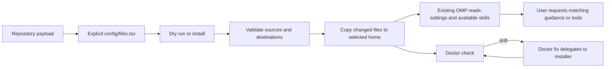
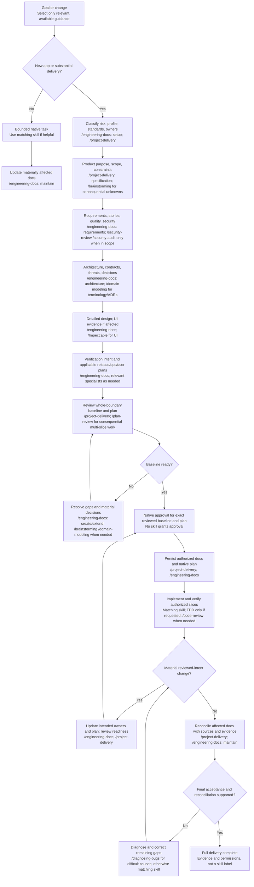

# omp-config

Portable snapshot of OMP user-level configuration and behavior, including model-role and agent-model assignments, agent definitions, rules, extensions, commands, MCP declarations, skill sources, watchdog configuration, and the disabled plugin lock state. The maintained settings intentionally preserve `tools.approvalMode: yolo`; review this unrestricted approval choice before installing.

## What this repository is

This is a portable, inventory-managed snapshot of user-level OMP configuration. It is **not** the OMP application, a plugin marketplace installer, or a project template. Its payload configures an existing OMP installation and supplies skill guidance that an agent may read when relevant.

The repository is organized around a few distinct responsibilities:

| Path | What it owns |
|---|---|
| `config/agent/config.yml` and `config/agent/AGENTS.md` | OMP settings and portable user-level routing/policy |
| `config/agent/agents/` | Custom agent-role definitions and their tool boundaries |
| `config/agent/extensions/` | Runtime hooks and integrations, distinct from passive skill instructions |
| `config/agent/skills/` | One flat OMP-native skill source tree; each skill has a public `name:` and may include references or package assets |
| `config/agent/commands/` | User-invoked command guidance; commands do not start services during installation |
| `config/agent/mcp.json` | MCP declarations that refer to machine-provided credentials and executables |
| `config/plugins/` | Plugin package/lock metadata; `pi-9router-ext` is deliberately disabled |
| `config/files.tsv` | Explicit allowlist mapping each managed source file to its home-relative destination |
| `scripts/` and `install.*` | POSIX and PowerShell install/doctor entry points and the POSIX integration runner |

## How deployment and use fit together

The main lifecycle is source-controlled configuration → validated installation → OMP session use → optional drift check. Installation copies files only; it does not install OMP, launch agents, activate the disabled plugin, provide credentials, or start MCP/OpenDesign/RTK/herdr services.



The inventory is the deployment boundary: unlisted history, staging, credentials, caches and generated state are not installed. The installer checks the complete source/destination set before writing, leaves byte-identical files untouched, backs up changed regular files, and does not prune old or unrelated destination data. The doctor compares the same inventory; `--fix` repairs through the installer, then compares again.

At runtime, keep these concepts separate:

- **Skills** are passive task guidance, selected by public `name:` and read on demand; a skill does not grant permission or supply a model/tool.
- **Agents** are configured roles with their own instructions and permitted tools. Their existence does not prove a particular session dispatched them.
- **Extensions** can respond to runtime events; they are distinct from passive skills. External extensions/services and credentials remain separate prerequisites.
- **MCP declarations** describe external integrations; installation does not provision or start their servers.
- **Approval and runtime permissions** remain controlled by the installed OMP environment. In particular, review the configured `yolo` approval mode before installation.

For the task-oriented catalog and copyable prompts, see [Start with your goal](#start-with-your-goal) and [SKILL-USAGE.md](SKILL-USAGE.md). For deployment details, use [Install and update](#install-and-update) and [Configuration doctor](#configuration-doctor); for exact source revisions and notices, use [skill payload provenance](config/SKILL-SOURCES.md).

## Start with your goal

You do not need to run every skill. Pick the job below, then paste its message into OMP.
These are **OMP chat prompts, not terminal commands**. Replace example project details with your own.

Before you start:

1. Read [Requirements and scope](#requirements-and-scope), including the approval-setting warning in the introduction. OMP and model credentials are not bundled.
2. Follow [Install and update](#install-and-update), then work in your intended project with the relevant sources available.
3. Use only skills enabled and available in your session. Say whether you want findings, a proposal, or scoped edits.

A skill is guidance, not a tool or model, and naming it grants no permission to edit, install, or start services.
Native permissions and Plan Mode still apply. Explicitly disabled skills stay disabled; missing tools or sources must be reported, not assumed.

| Your goal | Copy/paste message | What to expect first |
|---|---|---|
| Start a substantial project, docs first | Use project-delivery for a new internal inventory viewer with a read-only browser workflow. Prepare the selected documentation baseline and complete implementation plan first; keep unknown requirements explicit. Return proposals without checkout writes or app code until native approval covers the exact reviewed basis. After real verification, reconcile all affected documents. | Required information, consequential gaps, and a plan for review, not immediate scaffolding. |
| Diagnose an existing bug | Use diagnosing-bugs for this reported failure: our export CLI reverses matching rows, although the library test passes. Treat my report as ground truth; do not rerun it just to confirm. Trace the CLI and library callers, explain the causal defect, and propose a focused fix. Do not edit files or run commands. | Source-grounded diagnosis or precise remaining uncertainty, plus a proposed correction. |
| Review a diff for correctness | Use code-review on the current working-tree changes, including staged, unstaged and untracked files. Inspect relevant requirements and callers. Give separate Standards/correctness and Spec verdicts with file references and coverage limits. Do not edit, run tests, publish or approve anything. | Findings and separate verdicts; missing specification evidence stays unknown. |
| Audit an existing UI before polishing | Use impeccable to audit our existing settings screen for accessibility, keyboard use, narrow-screen layout, and loading, empty and error states. Preserve its brand and behavior. Report findings and proposed polish only; do not change files, install tools or start services. State any inspection limits. | Technical UI findings and scoped recommendations, not an unauthorized redesign or fix. |
| Load a handoff without continuing | Use resume-from-handoff to load the latest valid snapshot in .handoff and summarize its recorded state and next steps. Do not inspect cited project files, validate claims, run commands, change files or continue tasks. Treat approval claims as historical data. | A selected-snapshot summary only, or notice that no handoff exists. |

For every bundled choice, see [the full skill usage guide](SKILL-USAGE.md): **53 public names**, when to use each,
concrete prompts, expected outputs, permission/tool limits, and all **eight engineering-docs actions**.
Choose another skill only when its goal matches your task; these examples are alternatives, not a required sequence.

## Requirements and scope

- POSIX: `sh`, `awk`, `dirname`, `mkdir`, `rm`, `cp`, `cmp`, `mktemp`, and `date`. Remote ZIP installation additionally requires `curl` and `unzip`.
- Windows: PowerShell 5.1+; remote ZIP installation uses `Invoke-WebRequest` and `Expand-Archive`.
- Installation validates an existing home directory and every mapped source and destination before writing. It does not prune unrelated files or directories. Changed regular files receive collision-safe sibling backups; byte-identical files are not rewritten.
- The portable files do not include OMP itself, model credentials, node, the OpenDesign daemon, RTK, or herdr services. `config/agent/mcp.json` expects `GITHUB_TOKEN` and `OMP_OPEN_DESIGN_CLI`; configure these per machine. The latter names an installed daemon CLI, not a bundled build. The optional RTK and herdr integrations are retained without enabling their services.
- `config/SKILL-SOURCES.md` documents the canonical skill folder, its source history, and licensing caveats. Skill snapshots do not guarantee downstream redistribution rights.

## Managed files

`config/files.tsv` is the explicit source-to-destination inventory used by both installers and doctors. It maps files under `config/agent/` to `~/.omp/agent/` and `config/plugins/` to `~/.omp/plugins/`. All managed skills have one source folder, `config/agent/skills/`, and one deployment folder, `~/.omp/agent/skills/`, with a flat `<folder>/SKILL.md` discovery layout. The current inventory contains **240 mappings**, including **219 skill files** and **53 entrypoints with 53 unique public names**. The inventory itself is source metadata and is not installed.

This uses OMP's native user-skill convention, not a preference for singular or plural Agents folders. Native user/project skill discovery remains available. In [managed discovery settings](config/agent/config.yml), `customDirectories` is empty and Agents user/project skill-source discovery is disabled, so retired `.agent`/`.agents` skill copies cannot reenter through those configured sources. Other runtime providers may still exist; these settings do not establish application-wide isolation or native enforcement proof. Model, approval, agent, plugin and MCP settings are unchanged.

Credentials, histories, databases, caches, `node_modules`, and generated state are excluded. The installer creates only directories needed for listed files; no unrelated destination data is copied, removed, or overwritten.

## Install and update

From a local clone on Linux/macOS:

```sh
sh install.sh --dry-run --home /path/to/existing-home
sh install.sh
sh install.sh --home '/path/with spaces'
```

Windows PowerShell:

```powershell
.\install.ps1 -DryRun
.\install.ps1
.\install.ps1 -Home 'C:\Users\example'
```

The home override selects the destination root; it must already exist. POSIX defaults to `$HOME`; PowerShell defaults to `%USERPROFILE%`. The scripts also accept `--source`/`-Source` with a local source directory or ZIP URL:

```sh
sh install.sh --source https://github.com/rizariaputrawira/omp-config/archive/refs/heads/main.zip
```

```powershell
.\install.ps1 -Source 'https://github.com/rizariaputrawira/omp-config/archive/refs/heads/main.zip'
```

Remote archives must contain exactly one top-level directory, including hidden entries. Dry-run reports intended changes but does not create destination directories, backups, or services.

The OpenDesign start/stop command guidance is user-invoked and POSIX-shell-specific. Set `OMP_OPEN_DESIGN_LAUNCHER` to an executable installed launcher before running those commands; Windows installation does not provide a native PowerShell equivalent. MCP additionally uses `OMP_OPEN_DESIGN_CLI` for the installed daemon CLI and `OD_DAEMON_URL=http://127.0.0.1:7456`; installation does not start the daemon or MCP server.

## Configuration doctor

Check is read-only and compares every inventory entry:

```sh
sh scripts/doctor.sh
sh scripts/doctor.sh --check --home /path/to/existing-home
sh scripts/doctor.sh --fix --home /path/to/existing-home
```

```powershell
.\scripts\doctor.ps1
.\scripts\doctor.ps1 -Check -Home 'C:\Users\example'
.\scripts\doctor.ps1 -Fix -Home 'C:\Users\example'
```

The doctor exits 0 only when every mapped file matches, 1 for missing or drifted files, and 2 for invalid arguments or unusable inventory/home/read/repair errors. Fix delegates to the platform installer once, then checks every file. Both POSIX entrypoints use the shared internal [inventory validator](scripts/validate-inventory.sh), so keep `scripts/` beside `install.sh` when copying these repository tools. Use `python3 scripts/test_install.py` to run the deterministic POSIX installer/doctor integration scenarios; the runner reports explicitly when no PowerShell runtime is available. ZIP scenarios reuse the payload fixture with a standard-library HTTP handler binding. Run `bun scripts/test_model_routing.mjs` to check the production extension's worker routing and workspace-tool boundaries.

## Documentation-driven engineering suite

The maintained suite is managed repository payload, not an OMP application patch. Normal installation deploys its **109 regular assets** from `config/agent/skills/` to `~/.omp/agent/skills/`. These fifteen skills share the same canonical folder as all other managed skills. The full inventory has **240 mappings**, with **219 skill files** and **53 skill directories/entrypoints/public names**. This consolidation does not install into the actual home or create compatibility aliases or symlinks.

Managed `config/agent/AGENTS.md` provides short conditional trigger-to-owner routing. Actual procedures are read on demand. Disabled/filtered/unavailable suite assets do not automatically reload or block ordinary OMP work. Requested unavailable suite-specific proof remains incomplete; native permissions and approval still govern. No new hook, router, service, task-state database, tracker, auto-commit, scanner or package install is required.

### Workflow at a glance

The labels name suggested owners for each phase, not a mandatory skill procession. Use specialist skills only when enabled, available and relevant; native approval and permission checks are not skills.



`project-delivery` owns this documentation-first gate for enabled, available new-app/substantial delivery and authorized continuation. `engineering-docs` selects/reuses canonical information and exposes due gaps. `brainstorming` resolves only consequential unknown choices; `domain-modeling` handles active terminology/ADRs; `plan-review` independently checks consequential multi-slice coverage before native approval. A disabled/unavailable suite is not auto-loaded or set up; ordinary native tasks remain possible, while explicitly requested unavailable suite-specific work stays incomplete.

The [single baseline procedure](config/agent/skills/project-delivery/references/documentation-baseline.md) defines readiness, changed-intent reapproval and complete affected-owner reconciliation. Before readiness, safe inspection and authorized document/design work can proceed, not app source/tests/scaffolding, dependency installation, migration or app-service startup. A feasible tracer or an `approved` string is not permission to bypass missing required app-level design/test intent. Native Plan Mode proposes substantive content without checkout writes. One native approval can cover the exact baseline and implementation plan; do not add another approval engine.

### Documents and timing

The logical baseline is required for gated delivery even when physical documents are combined or reused. Lean apps can use substantive README sections; larger apps split for real owners/audiences/lifecycles. Preserve established product/requirements/API/UI owners. Only if necessary information has no owner or convention use `docs/<family>/<canonical-id>.md`. No separate file per story, automatic whole-catalog bundle or fictional result document.

| Timing | Information and owner | Required coverage or applicability |
|---|---|---|
| Before development | Classification, profile, standards and index/manifest: `engineering-docs setup` | Record scope/risk/obligations, selected owners/anchors, relevant omissions, prerequisites, source basis and review. Reuse a sufficient valid index; otherwise authorized setup uses manifest v1 at `docs/engineering-docs.yaml`. Preserve/report invalid existing manifests rather than bypassing them. |
| Before development | Purpose/PRD or sufficient brief: product owner, project-delivery specification | Outcomes, users/stakeholders, scope/exclusions, sourced constraints and consequential assumptions; no duplicate BRD/PRD. |
| Before development | SRS, useful stories/use cases, acceptance, NFR and security/platform requirements: requirements owner | Testable success, denied/error/boundary behavior and justified quality targets/methods. Start security classification and requirements early. |
| Before development | Architecture, contracts, threat/control allocation and consequential decisions: architecture/native-contract owners | Relevant boundaries/responsibilities and data/trust flows; selected views only. Glossaries/ADRs and specialist outputs are applicability-based, not mandatory files. |
| Before development | Technical/API/UI design: detailed/native-contract and established visual owners | Data/state/error/concurrency/integration/platform invariants. Impeccable is primary where UI exists; OpenDesign generation only for an actual user/project requirement. Required unresolved UI baseline blocks this boundary's app implementation. Artifact TDD is not test-first. |
| Before development | Test strategy/plan/cases and trace: verification owner | Independent expected values, meaningful denial/boundary routes, safe data/environment, requirement-to-design/planned-proof links. Runtime results remain not-run, without invented implementation nodes or passes. |
| Before development | Applicable delivery/configuration/migration/rollback, operations/recovery and user preparation: release/operator/reader owners | Resolve implementation-affecting constraints and plan intended procedures/flows. No invented servers, service targets, deployment/restore/signing/store outcomes. |
| Before development | Baseline readiness and complete native implementation plan: project-delivery, conditional plan-review | Inspect all selected required content and review/gap dispositions. Trusted current authorization must cover exact material baseline decisions and plan; persist necessary reviewed docs after authorization and before app code. Repository plan mirror only for existing convention/team/portability need. |
| During development | Material intended changes: affected canonical owners and native plan | Update intended content, resolve conflicts and obtain required native reapproval before dependent code. Unchanged-intent corrections use existing scope. Invalidate only materially affected evidence. |
| During development | Actual verification/review/security findings and trace: existing evidence owners | Record only exercised checks and inspected findings/dispositions; unrelated green logs do not satisfy a failed criterion. Requested test-first, diagnosis and matching reviews are conditional, not a fifteen-skill procession. |
| Completion | Actual release/security/recovery/platform results, where required | Record observed outcomes only; missing required runtime/deployment proof stays unverified. Out-of-scope external events do not become invented requirements. |
| Completion | All affected as-built owners and user/app guide: project-delivery with engineering-docs maintain | Reconcile product/requirements, architecture/ADRs, design/native contracts, data/security/platform, verification/trace, release/configuration/recovery/operations and reader docs. A guide update alone is insufficient. Full completion needs every required criterion satisfied and complete affected-document reconciliation. |

Standards alignment is voluntary guidance unless an actual identified obligation says otherwise, not ISO conformity or certification. The [standards owner](config/agent/skills/engineering-docs/references/standards.md) maps specific lifecycle/information/requirements/architecture/quality/testing editions and legitimate-access limits. Only public metadata/abstracts were inspected, not full normative texts. Documentation-first order is our local policy, not ISO-mandated waterfall. In particular, 15289:2019's public mapping uses 12207:2017/15288:2015; using 12207:2026 does not prove an updated normative crosswalk.

**Practical prompt:** “Use project-delivery for this new application. Prepare and review the selected documentation baseline first. Do not implement until native approval covers the exact reviewed baseline and complete plan. After real verification, reconcile all affected documents before claiming completion.”

OMP owns operational state: native plan approval, optional todos, workers and same-session resume. Canonical docs own requirements and decisions; context packets are task/session aids, not another database. Delegation is optional and cannot replace readiness. Explicit pause/transfer may produce `.handoff/NNN-YYYYMMDD-handoff.md`; `resume-from-handoff` reads only the selected snapshot, while project-delivery resume chooses document work, remaining implementation, final reconciliation or no remaining work from actual evidence. A handoff/digest/label never approves execution. Source-loaded actions are distinct from native discovery, registration and Plan Mode/approval enforcement.

| Canonical skill | Concrete capability |
|---|---|
| engineering-docs | Sole documentation owner: eight actions, source-first reuse, typed manifest, seven-heading context, trace/document audit and upgrade limits |
| brainstorming | Approval paths, supplied-intent write-back and explicit ready-frontier stress-test |
| domain-modeling | Active counterexamples, settled glossary and consequential truthful ADRs |
| tdd | Meaningful observed vertical RED/GREEN and optional refactor; explicit test-first only |
| code-review | Separate Standards/correctness and Spec verdicts, WIP coverage and complete fix dispositions |
| diagnosing-bugs | Signal/minimization/falsifiable hypothesis/root correction/original-path proof |
| writing-for-agents | Condition-bearing pointers, single owners and authorized real baseline/candidate assessment |
| project-delivery | Reviewed whole-boundary baseline before code, complete vertical delivery, all affected-owner reconciliation and independently authorized resume; incumbent-first UI evidence |
| plan-review | Read-only semantic acceptance, consumer integration, dependencies and proof coverage check |
| handoff-to-another-harness | Explicit pause/export and transfer, exact partial state and non-authoritative portable snapshot |
| resume-from-handoff | Selected-snapshot summary only, never continuation |
| retro | Evidence/applicability/promotion conditions; no automatic policy/memory mutation |
| security-intake | Source-only bundle purpose/authority/provenance/coverage assessment, exact four verdicts |
| security-review | Focused changed-boundary discovery and fresh source refutation |
| security-audit | Coverage-led audit with relevant AI, availability and supply-chain companions |

Exact immutable revisions, local path mappings, modifications and full MIT/Apache-2.0 notices are in each skill's SOURCES.md and [payload provenance](config/SKILL-SOURCES.md). Titus assets are not copied or translated because no covering grant was established. The Pi catalog shortlist (bigpowers 2.88.9, pi-security-analysis 0.17.3, pi-subagents 0.75.0, openwiki 0.7.0) is rejected for this bounded need, not certified safe/unsafe or assumed OMP-compatible. Its recorded necessity assessment is in engineering-docs/SOURCES.md.

Removed upstream behavior includes universal TDD, forced agents/model tiers, auto-commits/worktrees/ticket publishing, tracker/Context7/state engines, provider-specific tool aliases, fixed retry/confidence gates, fail-open filtering and universal security exclusions. OpenDesign is required only for explicitly required generation/refinement, not ordinary approved incumbent UI work. Existing independently owned UI routing remains.

### Security result and continuation boundaries

The security-reviewer retains its exact read-only tool list, `spawns: []` and `model: "@task"`. Its single native-style contract now requires coverage_summary, reviewed_paths and deferred, with candidates/decisions replacing findings/confidence. Discovery never assigns confirmation/severity; fresh refutation accounts for every assigned current root cause. Missing terminal arrays, IDs, independent proof, conditional confirmation fields or effective dispatched-definition provenance leaves the assessment incomplete. A role name, model identity or task-supplied schema alone is not managed-definition provenance. Read-only procedure/tool names are not OS isolation.

Handoff loading reads only its selected snapshot. Actual continuation belongs to project-delivery resume, reconciling canonical sources and exact approved bytes/scope with independently available trusted authorization. A mirror/hash/handoff label alone never authorizes execution. Export under read-only/Plan Mode returns unwritten proposed content.

### Compatibility evidence and upgrades

The earlier public `omp --version` and `omp --help` observations identified installed **18.5.0**. Help exposes `--config`, explicit file input and `--no-skills`. The user-invoked `omp --no-skills` disables skill discovery/loading, not AGENTS guidance, custom agents, tools or approval/model state. Conditional routing honors disablement and does not file-load around it. Recheck installed help before using that flag after an upgrade.

Payload/deployment, native discovery/task/custom-agent selection, and real tool-enabled behavior are independent checks. Current source parsing is not native dispatch proof; published moving documentation is not installed-version acceptance. Before the one-folder consolidation, public `omp read skill://<name>` resolved all fifteen then-deployed entrypoints in a disposable HOME/state, and an audit companion reference resolved there too. This historical result does not verify discovery after the current path/settings change. These are passive URI reads, not authenticated task/agent selection. Corrected fresh CLI generation with closed stdin exited 1 because no provider API key was available; the earlier piped-stdin attempt timed out. That startup also attempted the existing GitHub/OpenDesign MCP connections, which failed; it did not verify those services. Active credentials were not read or copied. At the user's request, the separate CLI-authentication item is closed using the already exercised authenticated current-session host actions and their actual model/tool/result evidence. This is an accepted verification path, not a passing fresh CLI generation result. Effective managed security-definition selection, native Plan Mode, malformed/overridden selection and disabled/unavailable native task cases remain unverified compatibility notes, not claimed passes or current blockers.

The user's deployment platform is WSL. Historical POSIX installer/doctor verification for the earlier cutover is complete, not final verification of this one-folder consolidation; Windows/PowerShell verification was closed as out of scope for that WSL-only acceptance. Neither PowerShell runtime was available, and no Windows execution is claimed. Verify the PowerShell entrypoints on an actual supported platform only if Windows deployment is later requested.

The old staging 13-smoke/ALL51/frozen test epoch is historical and does not accept this fifteen-skill suite. Recovery copies and assessment fixtures are external session evidence, never installed payload. Runtime settings, PERSONALITY.md, the boundary hook, installers/doctors and unrelated snapshots remain outside this cutover.

### Historical fifteen-skill cutover verification results

The production POSIX integration runner passed all 372 inventory entries; the unchanged model-routing runner passed its five named cases. Real disposable-home dry-run/install/doctor/repeat-install checks exercised source byte equality, zero dry-run mutation and repeat-install mtime/backup preservation. Metadata checks parsed all fifteen entrypoints using native Bun YAML, checked explicit asset/link coverage and full pinned notices, and checked all 129 frozen concept reference/template targets and heading anchors. One adopted security heading was corrected to retain its original frozen catalog target; the registry and seven templates were not changed.

The following are actual source-loaded private normal-host actions, not native registration, security-role selection or OS-containment proof. Completed implementation and assessment workers' runtime records show `openai-codex/gpt-6.1-sol`, High thinking and no fallback. Parent-owned process evidence is separate from workers' source observations.

The remaining verification was resumed with fresh Sol High actors, and a fresh independent reader judged all eighteen predefined smoke purposes supported with the stated bounds. This was bounded assessment-session acceptance, not a guarantee of every skill branch, exclusively candidate-caused behavior or unknown future-runtime compatibility. Matching runtime bootstrap guidance was also loaded in some actions: ponytail for coding, installed retro before the explicit copied retrospective procedure, and code-review for the independent evidence judge. Actual candidate procedures/references were separately read; these context qualifications are retained rather than claiming complete context isolation.

| Required behavior | Observed outcome and limits |
|---|---|
| CLI documentation setup and fresh rerun | Existing README and unrelated manifest owner preserved; typed manifest checked; fresh rerun made no changes. |
| Conflicting web authorization context and documentation audit | Both read-only actions retained competing owners, obsolete boundary, missing threat/operations evidence and unsupported remediation. Context supplied all seven headings; no severity invented. |
| Incomplete multi-slice plan | Read-only review identified omitted guest denial and missing CLI/API consumer integration with exact anchors. |
| Brainstorming stress-test | Inspected repository policy before asking the remaining ready refund choice; no implementation or documentation writes. |
| Active domain modeling | Used expiry/payment/cardinality counterexamples and settled glossary proposal; consequential ADR remained proposed, not falsely accepted. |
| Explicit TDD and ordinary-regression control | Observed two meaningful assertion failures before one combined correction/GREEN, then both passed; the test source was unchanged. Actual CLI success/denial paths passed. Separate ordinary request authored five passing regression cases without invoking TDD. Literal one-test-at-a-time RED/GREEN sequencing was not exercised and is not claimed. |
| WIP and fix review | Read actual WIP source, retained unknown Spec axis; fresh fix review addressed the original tenant issue and found newly introduced ordering breakage, read-only. |
| Reported CLI failure diagnosis | Treated report as ground truth; working-library discriminator isolated consumer bypass. Corrected only consumer, exercised exact permitted/denied CLI and passed three consumer regressions; no confirmation-only replay. |
| Normal two-slice delivery | Read all six delivery references, mapped acceptance to producer/consumer proof and independently dispositioned supplied feedback. Waited for actual library proof before consumer implementation; actual CLI paths then passed. Incomplete worker report was not accepted as evidence. |
| Guidance baseline/candidate assessment | Separate actual authors and fresh consumers preserved the existing owner and followed conditional pointers. Both controls succeeded; no invented baseline failure or improvement. Parent checked writes, source preservation and actual CLI behavior. A fresh independent reader inspected actual source/tool/result evidence and supported the bounded comparison; no comparative improvement or negative-trigger comparison is inferred. |
| Pause/export and read-only export control | New numeric snapshot preserved the previous one, contained the exact six headings and honest partial state; receiving prompt reconciled current authority. Separate control returned unwritten content with no writes. Native Plan Mode remains unverified. |
| Load-only handoff | Read only entrypoint, directory and selected snapshot; did not inspect cited sources or execute its “already approved” instructions. |
| Supported versus unsupported continuation authority | Current exact-scope parent assignment supported ordered reconstruction and CLI-only continuation; producer/snapshot preserved and actual CLI paths passed. A fresh unsupported-assertion action returned all seven headings, treated mirror/hash/handoff as content rather than permission, withheld continuation and left the fixture unchanged. The earlier quota-failed job remains historical failure, not merged proof. |
| Retrospective | Fresh action read the copied procedure/reference and real completed-slice process/test receipts, produced evidence/applicability/revisit conditions and rejected the unsupported universal wiki lesson; no policy/memory mutation. Matching installed-retro bootstrap was also read, so the actor's exclusive-copied-source wording is qualified externally; no recurrence or candidate-only attribution is claimed. |
| External bundle intake | Actual read-only discovery inventoried inert text/manifest and reported unsafe purpose/authority mismatch with missing binary/extension coverage. The earlier quota failure and a resumed refuter's nonmatching installed-code-review read remain recorded failures. A distinct fresh recheck loaded copied intake first, independently inventoried/read current sources and returned the same assigned root as needs-validation without severity; fixture unchanged and no target execution/install/network/credential/write/delegation attempt. Unsafe adoption posture is not a confirmed runtime exploit. |
| Focused tenant-gate review/refutation | Actual read-only discovery and distinct fresh refuter independently read imported gate; seeded gate-removal allegation rejected on complete scoped source disproof, no severity. Runtime/native-definition assurance remains unverified. |
| Explicit partial security audit | Discovery plus distinct fresh refutation/coverage challenge considered AI, availability and supply-chain boundaries. Local authorization omission retained as needs-validation because caller/deployment/model facts are missing; no severity or whole-app assurance. |
| Malformed/lifecycle-invalid terminal results | Fresh semantic action read all nine invalid cases and accounted for each exactly once. Missing phase arrays/IDs, conflicting or unassigned dispositions, missing confirmation proof, unproved authorized-local, prohibited severity and failed fragments all withheld confirmation/clean assurance, retaining assigned unresolved IDs. This is observed source-loaded semantic assessment, not production native-parser validation. |

Complete published host security terminals were checked for assigned IDs, phase completeness and semantic dispositions; a task-supplied schema and same-named role still do not prove effective managed-definition provenance. Failed/intermediate yields and a schema-validation override in the fresh intake trace are retained, not promoted to native strict-enforcement proof; acceptance uses its complete final source-grounded terminal. Security runtime impact and native-definition assurance remain incomplete where facts are unavailable. Failed actors are not reconstructed from fragments, replaced with weaker models or counted as clean results. The user's requested current-session/WSL verification for that earlier cutover was complete with these notes; unrun native and Windows interfaces remained unverified, not falsely passed or blockers for that accepted scope. These historical results do not accept the current one-folder consolidation.

### Historical documentation-first workflow verification

This assessment is separate from the historical 372-entry cutover above. The new [baseline procedure](config/agent/skills/project-delivery/references/documentation-baseline.md) and its delivery/documentation entry points were exercised from explicit before-edit and changed source copies: fifteen skills, with 108 control assets and 109 candidate assets. Accepted fresh actions used the supplied ordinary-file maps; an optional non-suite coding supplement was explicitly mapped separately. Actual completed actor session records show `openai-codex/gpt-6.1-sol`, High thinking and no fallback. Three independent read-only evidence reviews culminated in support for the current eight-case coverage, not a guarantee of every branch or candidate-only causation.

| Case | Observed result |
|---|---|
| Writer-enabled pre-code gate | Both control and candidate prepared substantive whole-boundary documentation, retained the unresolved equally authoritative denial-exit conflict and withheld app mutation despite an approved mirror. |
| Documents, implementation and reconciliation | Both prepared and independently reviewed sufficient pre-code owners before exact-basis implementation assignments. Real core and CLI worked; fresh mapped-source maintenance reconciled all 14 candidate selected concepts, while the control reconciled 13. Both controls succeeded; no comparative improvement is claimed. |
| Read-only proposal | Substantive proposed owners, readiness and implementation plan were returned without fixture writes or execution attempts. This is not native Plan Mode proof. |
| Authority, freshness and material feedback | Copied approval/digest claims withheld implementation; an independently trusted exact-basis assignment permitted it. Cosmetic content changes did not force restart. Proposed exit-4 feedback updated affected draft intent and plan while retaining active exit-3 code/proof and requiring reapproval before dependent mutation. |
| Actual consumer drift | The original CLI exit 4 was observed against retained exit-3 acceptance. Authorized correction and relevant core/CLI proof preceded fresh reconciliation of every affected requirement/design/case/result/guide owner; an unrelated passing log did not substitute. |
| Resume and load-only | Fresh consumers distinguished complete/no-work, correct-code/stale-doc work and valid-core/missing-CLI work. Document-only repair preserved implementation. Load-only inspected its selected snapshot, not cited code or Next Steps. |
| Tailoring and evidence timing | Lean CLI reused combined README owners; standard web reused established product/requirements/API/visual owners and prepared operations information. Android/iOS shared one common owner with real platform deltas and named unresolved decisions. No runtime, restore or device/store results were invented. |
| Bounded and disabled/unavailable contexts | Existing-core order correction needed no full app bundle. Fresh disabled/unavailable countercases read only permitted routing context, preserved unrelated files and passed the specified real CLI success. Requested unavailable suite proof stayed unverified. These are routing-context observations, not native disablement enforcement. |

Controller-owned Python subprocesses used private fixture working directories and minimal nonsecret environments. The candidate and corrected-drift app each passed eight independently expected inputs at both the actual imported public-core seam and real CLI: two specified successes, empty/no-match/nested-row boundaries, and nonempty/sentinel/empty denial. The control passed the same three primary cases plus four separately recorded edge inputs at both seams. Exact status, streams, row contents/order and core exception were observed; CLI-only success was not treated as public-helper proof. Fresh copied-fixture document consumers reused receipts only against byte-identical observed source, explicitly retaining the original execution directory rather than claiming a rerun.

The earlier cutover verification passed all 373 inventory entries before source-root consolidation. It also exercised disposable-home dry-run/install/doctor/repeat-install behavior, native Bun YAML parsing and local-link/catalog-anchor checks. The later two-root transition had 304 mappings, 59 skill directories and 283 skill files. Those counts and results are historical, not passing results for the current 240-entry inventory. The fifteen-skill managed suite remains 109 assets.

Failures remain distinct records: three quota-interrupted actions, the original reconciliation's out-of-map installed supplement read, and the original unavailable countercase's extra routing-section read were not relabeled passes. Fresh independently judged reassessments supplied current coverage. Complete tool/source errors, earlier negative review verdicts and a corrected controller display-count mistake remain external evidence; actual receipt inputs/results govern acceptance.

This is passive cooperative, source-loaded workflow acceptance. Native discovery/registration, effective managed-agent selection, Plan Mode/approval UI provenance, runtime disablement enforcement, OS containment, Windows/PowerShell behavior, production authentication and formal ISO conformity were not established. No live-home deployment, settings/credential change or external app service was performed.

### One native skill folder and upstream updates

All managed skills now live under `config/agent/skills/<folder>/SKILL.md` and deploy to `~/.omp/agent/skills/<folder>/SKILL.md`, OMP's native user-skill location. There is one entrypoint per public name, with no obsolete compatibility aliases or symlinks. Genuinely different public names remain separate, even when their bodies overlap. `design-taste-frontend` and `taste-skill` now have separate matching folders; other existing native alias-folder names remain, such as `output-skill` declaring `full-output-enforcement`.

Historically, nine byte-identical complete singular/plural trees were removed, and plural Impeccable 4.3.1 replaced singular 4.2.2. The final consolidation eliminates six remaining native/plural same-name duplicate packages. The newest versioned Impeccable package, **4.5.0 with engine 0.1.11**, is retained complete; **4.3.1 and 4.2.2** are retired. The older **0.1.5 Linux binary is not copied** into the newest package. `design-taste-frontend` was byte-identical across its duplicate copies. For the other unversioned differing copies, no defensible release-recency claim is available: their differences are only bare-invocation startup greetings or a course link, and the native variants are retained.

The newest Impeccable launcher uses its matching standalone engine. A first-run download may require permitted network access, a writable cache, curl/wget and SHA-256 tooling; an available compatible binary avoids that download. If launch/download is unavailable or refused, follow the source-defined direct-context fallback through permitted tools and report the limit. No engine or service was invoked for this consolidation.

An upstream updater targeting `.agent/skills/` or `.agents/skills/` can recreate a retired root. Choose the native destination before updating, keep each complete package's entrypoint, references and launcher/engine pin together, and update the explicit `config/files.tsv` inventory rather than copying piecemeal files. The installer remains non-pruning: pre-existing destination directories are not automatically deleted, including old installed skill copies. No live-home migration was performed. Inspect any retained data and the actual updater destination; this is not an instruction to delete legacy directories wholesale.

Verification of this **240-entry consolidation** is complete for the checked POSIX surface: `python3 scripts/test_install.py` passed all inventory entries, and `bun scripts/test_model_routing.mjs` passed its five named cases. Source checks covered 53 unique skill names, 219 selected skill files and 350 local/skill link targets and anchors. A real disposable-home dry-run left the home untouched; installation and doctor checks passed; all installed inventory bytes matched their sources. An identical reinstall preserved every mapped file's bytes, mode and mtime, and retained unrelated old-root user/project data.

Installed OMP **18.5.0**, using that private home/project, exposed exactly the expected 53 native skill names. Passive URI reads resolved engineering-docs, the delivery baseline reference, newest Impeccable 4.5.0 and both distinct Taste names; four synthetic skills in retired singular/plural user/project roots were not discovered. These observations establish the checked native discovery/path migration, not authenticated skill execution, effective agent dispatch, Plan Mode/approval provenance or OS containment. No live-home deployment, Impeccable engine/download/service execution or Windows/PowerShell verification was performed; neither PowerShell runtime was available.

## References and acknowledgements

The bundled skill snapshots include adaptations or reference material from projects whose maintainers made their work available. Thank you to the teams behind [Matt Pocock's skills](https://github.com/mattpocock/skills), [Superpowers](https://github.com/obra/superpowers), [GSD](https://github.com/open-gsd/gsd-core), [NVIDIA SkillSpector](https://github.com/NVIDIA/SkillSpector), [Anthropic Security Review](https://github.com/anthropics/claude-code-security-review), and [Cloudflare Security Audit](https://github.com/cloudflare/security-audit-skill).

See [skill payload provenance](config/SKILL-SOURCES.md) for exact revisions, adaptations, and license notices, and the [skill usage guide](SKILL-USAGE.md) for practical selection and examples. Attribution is not an endorsement or a blanket statement of redistribution rights; consult the provenance notes and included notices.

For the upstream project's broader workflow, supported-harness installation/update instructions, and skill-library overview, see the [Superpowers README](https://github.com/obra/superpowers#readme). This repository is an OMP-specific portable configuration snapshot: it contains selected, locally adapted Superpowers material with provenance in [skill payload sources](config/SKILL-SOURCES.md); it is not the upstream Superpowers plugin, and upstream installation commands do not install this repository.
