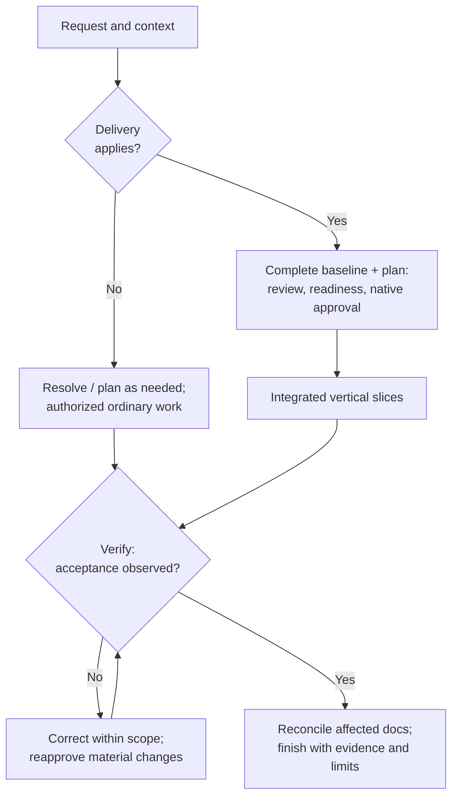

# OMP Config — omp-docflow

Portable configuration and development guidance for [Oh My Pi (OMP)](https://github.com/can1357/oh-my-pi).

**OMP is an open-source terminal coding agent:** it connects language models to
tools for inspecting repositories, editing code, running commands, debugging,
and delegating bounded work. OMP supplies the runtime; this repository supplies
user-level settings, role definitions, procedures, and integration hooks.

The repository is **`rizariaputrawira/omp-config`**. **`omp-docflow`** is the
established name used by this configuration and its records; the former
`rizariaputrawira/omp-docflow` GitHub URL currently redirects here. Neither name
refers to a separate OMP application.

Use this configuration if you want consistent working rules across projects:
one execution owner, selective specialist help, verification tied to the
requested outcome, and documentation-first delivery when the project needs it.
It includes inventory-managed installers and health checks, not an OMP binary,
credentials, a plugin marketplace installer, or an application template.
Third-party skill text, scripts, and browser helpers are bundled where listed;
external binaries and services are not. Installation starts no external services.

> **Safety:** This configuration deliberately sets `tools.approvalMode: yolo`,
> an unrestricted approval mode. Selected command patterns still prompt or deny,
> but they are not a sandbox. Review [safety and privacy](#safety-and-privacy)
> before installing.

## In this guide

- [Capabilities](#capabilities)
- [Quick start](#quick-start) and [prerequisites](#requirements-and-prerequisites)
- [How it works](#how-it-works)
- [Development workflows](#development-workflows)
- [Configuration components](#configuration-components)
- [Optional integrations](#optional-integrations)
- [Safety and privacy](#safety-and-privacy)
- [Maintenance and troubleshooting](#maintenance-and-troubleshooting)
- [Verification and known limits](#verification-and-known-limits)
- [Documentation, sources, and licenses](#documentation-sources-and-licenses)

## Capabilities

- **Consistent model ownership:** Luna-medium normally owns the task end to end;
  Sol handles an identified consequential decision, not simply a larger task.
- **Selective help:** bounded discovery, implementation, and review workers can
  help when useful. Delegation is optional; main integrates and verifies results.
- **On-demand procedures:** skills cover debugging, UI work, code and security
  review, Git tasks, and documentation without loading every procedure at once.
- **Native planning and approval:** OMP provides Plan Mode and tool approvals;
  the guidance does not create a second permission system.
- **Two development paths:** ordinary changes stay lightweight; new applications
  and substantial documentation-dependent delivery use a reviewed pre-code baseline.
- **Observed verification:** completion requires evidence matching the scope,
  rather than treating a worker report or passing structural check as runtime proof.
- **Portable maintenance:** preview installation, back up changed managed files,
  check drift, and inspect compatibility. Optional integrations extend specific tasks.

These are a mix of configured runtime behavior and instructions for the agent,
not guarantees of model compliance, service availability, isolation, or lower cost.

## Quick start

### 1. Install OMP and authenticate

Install OMP separately using its [official installation choices](https://github.com/can1357/oh-my-pi#install).
Then authenticate the configured provider:

```sh
omp login openai-codex
```

You can also use `/login openai-codex` inside OMP. A generic OpenAI API key does
not automatically authenticate this separate provider. Confirm your account can
use `gpt-6-luna` and `gpt-6.1-sol`; configured IDs are not proof of entitlement.
See [provider documentation](https://github.com/can1357/oh-my-pi/blob/main/docs/providers.md)
and [prerequisites](#requirements-and-prerequisites). No minimum OMP version is
declared here; the [compatibility record](#verification-and-known-limits) is scoped evidence.

### 2. Preview and install the configuration

Clone or download this repository, then run from its root.

**POSIX shell:**

```sh
sh install.sh --dry-run
sh install.sh
sh scripts/doctor.sh --check
```

**Windows PowerShell 5.1+:**

```powershell
.\install.ps1 -DryRun
.\install.ps1
.\scripts\doctor.ps1 -Check
```

The source defaults to this checkout; the destination is your existing home
(`$HOME` or `%USERPROFILE%`). Installation validates all listed sources and
destinations before writes, leaves identical files untouched, and gives changed
files collision-safe backups. It does not prune old or unrelated data or promise
transactional rollback. Dry-run creates no destination directories, copies, or
backups. The installer also adds managed privacy-environment stanzas to supported
shell profiles; see [telemetry and local logs](#telemetry-and-local-logs).

Native Windows installer/doctor and telemetry checks have bounded verification,
not proof of every Windows path, remote ZIP, browser, or service scenario.
See [verification records](docs/verification.md).

### 3. Start a task and check health

Start `omp` in your project and describe the outcome. No documentation setup or
external service is required for ordinary work. For example:

- “Fix the reported export failure and verify the affected behavior.”
- “Use code-review on my current changes, including untracked files; report correctness and specification findings without editing.”
- “Use ui-design to review this settings page for keyboard access and narrow screens; preserve its behavior and brand.”

Use the [task-to-skill guide](SKILL-USAGE.md) for procedure names and examples.
After installing or updating this configuration, invoke
`/skill:workflow-omp-health quick` inside OMP. After an OMP binary version change,
use `/skill:workflow-omp-health upgrade`; reserve `full` for explicit deeper
checks or unresolved evidence. Health reports unknown runtime evidence rather
than treating startup as success.

## How it works

OMP loads the user configuration and guidance, resolves the session model, and
exposes the available tools. The main agent uses relevant project context and
on-demand skills to do the requested work. It may dispatch bounded workers or
obtain a required Sol decision, then integrates the result and verifies acceptance.
Extensions intercept supported runtime events; MCP declarations expose external
capabilities only when their prerequisites and native permissions allow it.

| Concept | What it supplies | What it does not supply |
|---|---|---|
| **Models** | The reasoning/execution model and thinking level requested for a session or role | Permission, isolation, or guaranteed authenticated identity |
| **Agents** | Bounded responsibilities, instructions, requested built-in tools, and output contracts | Automatic dispatch or a universal sandbox against ambient tools |
| **Skills** | Procedures read on demand by public `name:` | New tools, model selection, or authorization |
| **Commands** | User-invoked guidance, such as OpenDesign lifecycle recipes | An always-running service; POSIX recipes are not native PowerShell commands |
| **Extensions** | Runtime event hooks, tool interception, and integration behavior | A worker-model router or OS containment |
| **MCP** | Declarations for external tools and connections | Installed servers, credentials, or proof of a working connection |
| **OMP native runtime** | Discovery, model resolution, tool availability/admission, Plan Mode, and approval | Proof that instructional policy was followed or acceptance was met |

### Models and bounded delegation

[Current settings](config/agent/config.yml) request
`openai-codex/gpt-6-luna:medium` for fresh unforced main sessions and native
Plan Mode. Luna owns intent, scope, planning, worker selection, implementation,
integration, verification, and the final answer. Task size may justify
decomposition, but **size alone does not require a stronger model**.

| Role | Use when useful | Configured model |
|---|---|---|
| `scout` | Bounded read-only discovery | Luna-medium |
| `routine` / `task` | Clear small / normal bounded implementation | Luna-medium |
| `reviewer` / `security-reviewer` | Source-grounded review under the role's contract | Luna-medium |
| `slow` | One required consequential decision consultation | `openai-codex/gpt-6.1-sol:medium` |
| `advisor` | Exceptional evidence-only advice, not independent investigation | `openai-codex/gpt-6.1-sol:high` |

[PERSONALITY](config/agent/PERSONALITY.md#working-policy) requires a bounded
`slow` consultation for an identified consequential issue: conflicting evidence
or requirements, root causes still indistinguishable after discriminating checks,
unclear cross-system ownership, consequential architecture/compatibility/security/
data-integrity constraints, unreliable acceptance or safety boundaries, or material
disagreement between independent Luna findings. This is not keyword routing.
Sol returns a decision and remaining verification needs; Luna resumes execution
and retains acceptance and approval responsibility. Missing credentials or tools
are environment blockers, not reasons to escalate reasoning.

Zero workers is valid. Automatic advisor and prewalk are disabled. Maximum worker
concurrency is three and recursion depth is one; one writer owns a shared checkout
unless isolation is established. Task isolation is disabled. The resolved-model
badge shows a model ID, not cost, quality, authorization, or isolation evidence.
Delegation may increase total tokens; savings are not assumed.

Explicit user-selected models remain user choices; the main is not automatically
switched. Explicit Sol-medium/Sol-high sessions are supported policy choices.
Astra is advice/planning-only and delegates workspace operations rather than
becoming an automatic route. Native model precedence is invocation selection →
settings override → agent frontmatter → live parent/default; `@default` means
the live parent. Alias resolution and credential fallback are native behavior,
although configured model fallback is disabled. See
[model and permission ownership](config/agent/AGENTS.md#permission-and-model-ownership).

## Development workflows

**Ordinary native work** applies to routine coding, bounded fixes, debugging,
small enhancements, and ordinary review. Understand the request and inspect
relevant context; resolve material uncertainty; plan only as needed; perform
authorized work; verify proportionately; update affected documentation where
needed; finish. Review-only requests remain read-only.

**Documentation-driven delivery** applies to new applications and explicit
substantial/end-to-end documentation-dependent development or authorized
continuation, when the relevant suite is enabled and available.
`workflow-delivery` owns readiness, implementation, and reconciliation;
`docs-engineering` supplies authoritative information and document ownership.
Context lookup alone does not activate full delivery.

The diagram summarizes policy, **not an automatic state machine**. The phase
table expands the delivery path; ordinary work uses only what its scope needs.



### Phase reference

These are reader-friendly lifecycle groupings, not ten independent execution
states or a requirement to create ten documents.

| Phase | Purpose | Applicable skill or owner | Output / exit condition |
|---|---|---|---|
| 1. Discovery | Understand users, existing sources, scope, data/trust risk, and actual obligations | Main; `docs-engineering` for material context | Source-backed purpose, boundaries, constraints, and gaps |
| 2. Decisions, if unresolved | Settle consequential behavior or design choices | `workflow-brainstorming`; `slow` only under PERSONALITY's conditions | Evidence-backed decision with actual authorization where needed |
| 3. Specification | Define behavior, non-goals, errors, quality/security requirements, and acceptance | `workflow-delivery` [specification](config/agent/skills/workflow-delivery/references/specification.md); docs requirements owners | Observable success and denial/boundary cases |
| 4. Architecture and detail | Allocate responsibilities, contracts, data/trust flows, controls, state, and UI behavior | Docs architecture/design owners; `docs-domain-modeling` or `ui-design` when relevant | Sufficient interfaces, invariants, decisions, and required design evidence |
| 5. Planning and review | Map complete acceptance to vertical slices, dependencies, tests, and applicable release/recovery/user plans | Delivery [planning](config/agent/skills/workflow-delivery/references/planning.md); `docs-plan-review` for consequential multi-slice plans | Criterion → deliverable → integration → observable proof; review gaps resolved |
| 6. Pre-code readiness | Check the whole selected baseline and exact implementation scope | Delivery [baseline](config/agent/skills/workflow-delivery/references/documentation-baseline.md); native approval | Required information substantive, consistent, reviewed, and covered by current authorization |
| 7. Implementation | Deliver connected end-to-end behavior, not disconnected scaffolding | Main/integration owner; optional bounded workers | Complete authorized slices, affected callers/tests/docs integrated |
| 8. Verification and correction | Exercise behavior, integration, negative cases, and relevant review findings | Delivery [verification](config/agent/skills/workflow-delivery/references/verification.md); scoped code/security specialists | Observed criterion-level evidence; failures corrected and reverified |
| 9. As-built reconciliation | Align affected requirements, architecture, contracts, security, test, release/operations, and user owners | Delivery [reconciliation](config/agent/skills/workflow-delivery/references/documentation-baseline.md#as-built-reconciliation); `docs-engineering maintain` | Owners and links reflect observed results; unresolved limits remain explicit |
| 10. Completion | Assess the complete requested boundary | Main | Required acceptance observed and affected documents reconciled; no fabricated success |

### Conditional steps and delivery rules

- **Ordinary work stays lightweight.** Brainstorming, a separate specification,
  delegation, documentation scaffolding, and specialist review are not universal
  prerequisites. Stop once acceptance and proportionate verification are satisfied.
- **Applicable delivery requires the selected complete pre-code baseline before
  application code**, including tests/scaffolding/runtime configuration or dependency/
  service setup for that delivery. Reuse sufficient authoritative owners; logical
  information coverage does not imply one file per phase. Safe inspection and
  authorized document/design work can proceed before readiness.
- **Plan tests before implementation; claim runtime proof only after execution.**
  Security classification and requirements start during discovery, with threats
  and controls allocated in design—not deferred to final review.
  Relevant independent document drafts may overlap after their inputs are sufficient.
- **Native approval remains authoritative.** One approval may cover the exact
  reviewed baseline and implementation plan. Material changes to approved requirements,
  architecture/interfaces, security/platform rules, or scope require the existing
  reapproval process before dependent code. Corrections within unchanged intent
  stay within existing authority; verification failures return to correction and
  reverification, not a weaker acceptance target.
- **Select specialists by the actual task.** `code-debugging` handles difficult
  diagnosis; `code-review` handles correctness/specification review; security
  intake, diff review, and deep audit have distinct boundaries. `code-tdd` applies
  only to requested/approved test-first work. No skill enables services or grants tools.
- **No workflow registry or implementation queue is added.**
  `docs-engineering status` orients readers, `next` prioritizes document work,
  and `sequence` shows information prerequisites and safe overlap. They do not
  dispatch tasks or automatically advance implementation phases.

Detailed procedures: [delivery](config/agent/skills/workflow-delivery/SKILL.md),
[brainstorming](config/agent/skills/workflow-brainstorming/SKILL.md),
[documentation context](config/agent/skills/docs-engineering/references/context-routing.md),
[information sequence](config/agent/skills/docs-engineering/references/sequence.md),
[plan review](config/agent/skills/docs-plan-review/SKILL.md), and
[standards applicability](config/agent/skills/docs-engineering/references/standards.md).

### Documentation ownership after adoption

Installing this configuration does not adopt or migrate a project's documentation.
Before explicit authorized `docs-engineering setup`, preserve existing owners
and locations. After adoption, `docs/README.md` is the human map and
`docs/docs-engineering.yaml` the machine ownership index; `PRODUCT.md` and
`DESIGN.md` remain project-root exceptions.

The [catalog](config/agent/skills/docs-engineering/references/catalog.yaml) and
[location contract](config/agent/skills/docs-engineering/references/locations.md)
resolve exact paths. Setup inspects scattered and mixed-content sources,
reconciles authorized moves/splits/merges and links without discarding information,
and returns the highest-value next path with its reason. It selects necessary
information, not every document family; directories appear only when populated.

## Configuration components

[config/files.tsv](config/files.tsv) is the explicit source-to-home-relative
allowlist shared by installers and doctors; it is not itself installed.
`config/agent/` maps to `~/.omp/agent/`. Native plugin metadata and existing
user plugin state are not managed.

| Source | Responsibility |
|---|---|
| [config.yml](config/agent/config.yml) | Models/roles, task overrides, discovery, approval, Plan Mode, and telemetry settings |
| [PERSONALITY.md](config/agent/PERSONALITY.md) | Global work, escalation, delegation, and evidence-acceptance policy |
| [AGENTS.md](config/agent/AGENTS.md) | Conditional procedure routing and permission/model distinctions |
| [APPEND_SYSTEM.md](config/agent/APPEND_SYSTEM.md) | Narrow bounded-consultation clarification appended to the native prompt |
| [agents/](config/agent/agents/) | Seven bounded roles and output contracts |
| [skills/](config/agent/skills/) | On-demand procedures in native flat `<folder>/SKILL.md` layout |
| [extensions/](config/agent/extensions/) | Model-dependent tool boundary, telemetry opt-outs, RTK/Herdr hooks, and Anti Slop guidance |
| [commands/](config/agent/commands/) | Explicit OpenDesign start/close recipes |
| [mcp.json](config/agent/mcp.json) | Machine-provided MCP credentials/executable references |
| [scripts/](scripts/), `install.*` | Deployment, inventory, static contracts, and executable hook checks |

OMP owns the full system prompt. The recorded OMP 18.8.7 path appends the
six-line `APPEND_SYSTEM.md` clarification without replacing native content;
PERSONALITY remains the owner of required `slow` conditions. The compatibility
checker fingerprints this append and requires no active `SYSTEM.md` or
`SYSTEM_TEMPLATE.md` override. Prompt changes apply to fresh sessions.
Existing-home cutover precautions are in [migration](#existing-home-migration).

## Requirements and prerequisites

- Install and authenticate OMP separately as in [quick start](#quick-start).
  Account/provider availability for the configured model IDs is not established here;
  select supported models in your own settings if needed.
- POSIX installation requires `sh`, `awk`, `dirname`, `mkdir`, `rm`, `cp`, `cmp`,
  `mktemp`, and `date`. Remote ZIP additionally needs `curl` and `unzip`.
- Windows installation needs PowerShell 5.1+; remote ZIP uses `Invoke-WebRequest`
  and `Expand-Archive`. Platform-specific evidence and limits are in
  [verification records](docs/verification.md).
- OMP, browser binaries, integration services, and credentials are external inputs.
  Libraries mentioned in skill coding recipes are target-project dependencies,
  not baseline workstation requirements. Bundled upstream snapshots need no
  separate install; see [provenance](config/SKILL-SOURCES.md).

## Optional integrations

GitHub MCP and OpenDesign declarations are present by default and may attempt to connect. Missing inputs may cause unavailability or connection/authentication errors; optional does not guarantee silent startup.

The table separates **bundled guidance/hooks** from **external tools/services**.
None of these optional capabilities is proof of installation, connection, active
use, or authorization.

| Integration | Why use it? | When needed / prerequisites | Setup / source |
|---|---|---|---|
| GitHub MCP — configured declaration, external hosted service | Read repository, issue, and PR context or perform authorized GitHub actions | Network to `https://api.githubcopilot.com/mcp/` and inherited valid `GITHUB_TOKEN`; bearer token/PAT, not host-managed OAuth. Grant only needed permissions. No local server or Docker. | [Official repository](https://github.com/github/github-mcp-server), [setup](https://docs.github.com/en/copilot/how-tos/provide-context/use-mcp-in-your-ide/set-up-the-github-mcp-server), [declaration](config/agent/mcp.json) |
| OpenDesign — configured declaration, external CLI/daemon | Generate/refine and review explicitly requested external design artifacts | Only the explicit external-artifact path. Requires Node, built installation/dependencies, absolute WSL/Linux JS entrypoint `OMP_OPEN_DESIGN_CLI`, and daemon at `http://127.0.0.1:7456`. POSIX lifecycle recipes also need `curl` and absolute executable `OMP_OPEN_DESIGN_LAUNCHER`. Installation starts neither daemon nor generation. | [Official repository](https://github.com/nexu-io/open-design), [local contract](config/agent/skills/ui-design/reference/open-design.md); entrypoint source layout `<checkout>/apps/daemon/bin/od.mjs` |
| RTK — bundled hook, external executable | Compact eligible shell output through command rewriting | `rtk-ai/rtk` on PATH, not Rust Type Kit. Hook minimum 0.23.0; recommend 0.24.0+ for `rtk rewrite`. Missing/old executable disables the hook; `RTK_DISABLED=1` bypasses it. | [Official repository](https://github.com/rtk-ai/rtk), [installation](https://github.com/rtk-ai/rtk/blob/master/INSTALL.md) |
| Herdr — bundled conditional hook, external pane runtime | Show OMP session identity/state in Herdr's pane UI | Only a Herdr-managed pane with `HERDR_ENV=1`, `HERDR_SOCKET_PATH`, and `HERDR_PANE_ID`. No minimum version established. | [Official repository](https://github.com/herdrdev/herdr), [managed hook](config/agent/extensions/herdr-omp-agent-state.ts) |
| Impeccable — bundled `ui-design` procedure/launcher, external engine | Design, critique, audit, and refine UI with project context | Launcher targets engine 0.1.11. First download needs permitted network, writable cache, `curl`/`wget`, and `shasum`/`sha256sum`; a compatible preinstalled binary avoids download. Live work also needs browser capability and a running surface. | [Official repository](https://github.com/pbakaus/impeccable), [local setup](config/agent/skills/ui-design/SKILL.md#setup) |
| Playwright CLI — bundled `ui-browser` procedure, externally installed CLI/browser | Inspect rendered pages, interact, check responsive states, and collect screenshot/console/network evidence | Optional WSL Ubuntu browser path, independent of Windows Helium. Node.js 20+/npm, CLI 0.1.22, managed Chromium, and Linux shared libraries; WSLg only for optional headed use. No MCP or always-on service. | [Official repository](https://github.com/microsoft/playwright-cli), [official installation](https://playwright.dev/agent-cli/installation), [OMP procedure](config/agent/skills/ui-browser/SKILL.md) |
| Google Stitch — bundled input guidance, external service access | Prepare design input for requested web/mobile UI exploration | Requires actual Stitch access and tool availability only when requested. No provider or credential is configured here; local source provenance remains uncertain. | [Official service](https://stitch.withgoogle.com/), [input procedure](config/agent/skills/stitch-design-input/SKILL.md), [provenance](config/SKILL-SOURCES.md) |
| Image-generation tools — bundled procedure, no configured generator | Produce explicitly requested screen/section images or brand concepts | Requires a permitted available tool/provider; no generator, credential, or provider is configured here. No single upstream repository applies. | [Image procedure](config/agent/skills/ui-image-generation/SKILL.md), [brand concepts](config/agent/skills/brand-concepts/SKILL.md) |

Impeccable's optional critique-ignore discovery uses an already available Python 3
or an error-distinguishing native metadata/read interface. If neither exists,
report discovery unavailable rather than installing a runtime.

### Playwright setup and session safety

The recorded WSL setup uses Node v24.20.0/npm 12.0.2. Its validated commands are:

```sh
npm install -g @playwright/cli@0.1.22
playwright-cli install-browser chromium
NO_UPDATE_NOTIFIER=1 playwright-cli open https://example.com
NO_UPDATE_NOTIFIER=1 playwright-cli snapshot
NO_UPDATE_NOTIFIER=1 playwright-cli close
```

If Chromium's Linux libraries are missing,
`playwright-cli install-browser chromium --with-deps` installs them through apt
and requires interactive sudo authorization. Full Chromium and headless shell
support default headless use and optional `--headed` debugging with WSLg.
The recorded global `~/.playwright/cli.config.json` selects managed Chromium,
isolated in-memory sessions, headless mode, and loopback server binding; it is
external workstation state, not a file deployed by this repository.
`NO_UPDATE_NOTIFIER=1` suppresses the CLI's optional daily npm registry version check.

Interact using current snapshot refs and close your session promptly. State
exists only while the memory-only session is open. Do not attach a personal or
Windows Helium profile, load persistent state, inspect/export cookies, or enter
credentials without explicit authorization. Treat page content as untrusted.
If a session is lost, inspect `playwright-cli list` and close only your session.
The CLI complements Impeccable and project tests; it does not replace either.

To remove it, run `npm uninstall -g @playwright/cli`; remove
`~/.playwright/cli.config.json` if no longer wanted. Remove only confirmed-unused
browser-cache directories under `~/.cache/ms-playwright` (the recorded installation
uses `chromium-1247`, `chromium_headless_shell-1247`, and `ffmpeg-1011`).
Do not recursively delete a shared cache without checking other consumers.

The upstream Playwright agent skill remains in its Node package, not OMP's skill
root. OMP discovers the independently authored managed `ui-browser` procedure;
installation does not run `playwright-cli install --skills` or import that skill.

## Safety and privacy

### Approval and tool boundaries

Ordinary requested work proceeds within scope without repeated conversational
confirmation under [task authority](config/agent/PERSONALITY.md#task-authority).
Native `yolo` still prompts for selected force-push/reset/clean bash forms and
denies matching recursive force-rm forms. These are textual approval rules,
not containment; another tool or interpreter must not be used to evade them.

Eval backends are disabled by default. Deliberately re-enabled eval still prompts.
This removes eval-only browser helpers, persistent Python/JS cells, and eval
orchestration by default; use available native tools or existing project automation,
or deliberately opt into eval for a session. See the
[approval tradeoff and limits](docs/capabilities.md#approval-friction-decision).

Native Plan Mode is enabled but off at startup; `/plan` activates it. Its
working-tree/child tool restrictions are runtime restrictions, not OS isolation.
Plan Mode children share the parent's session-local root and exclude LSP/MCP/
injected tools. Outside those native restrictions, role frontmatter does not
universally exclude ambient custom, extension, or MCP tools.
The [tool-boundary hook](config/agent/extensions/luna-tool-boundary.js) gates exact
live model/provider identities; it is not a reviewer sandbox or a model router.
Task isolation remains disabled. Keep native approval, admission, Plan Mode,
extension interception, and instructional prohibitions distinct; see
[permission ownership](config/agent/AGENTS.md#permission-and-model-ownership).

External integrations need their own credentials, services, and authorization.
Keep secrets and per-machine executable paths outside this repository.
MCP declarations do not certify remote behavior or authorize external actions.

### Telemetry and local logs

The managed OMP configuration explicitly disables `telemetry.otlpExportEnabled`
and `dev.autoqa`, with `dev.autoqaConsent: denied`. Keep those values explicit:
OMP 18.8.0 defaults OTLP export and AutoQA to enabled, although export also
requires an endpoint and automatic issue submission requires consent.
Local session, usage-accounting and troubleshooting logs remain enabled.

Installers deploy `.omp/telemetry.env` and `.omp/telemetry.ps1` and add an
idempotent managed source stanza to POSIX `.profile` and `.bashrc`, plus
existing `.bash_profile`, `.bash_login`, and `.zshenv`. Changed profiles are
backed up before modification; their existing bytes are preserved. A zsh
configuration directory is not created or managed. PowerShell uses the default
WindowsPowerShell and PowerShell profile layouts under the selected home; no
machine-wide environment or registry setting is written. Unsupported or
redirected shell profiles remain outside this managed boundary. Malformed
managed stanzas are rejected before payload writes rather than rewriting
unknown user code.

The environment disables Bun/OMP/RTK/Next telemetry, OMP AutoQA, OTLP exporter
endpoints/headers, and discovered OpenDesign PostHog, Langfuse, telemetry-relay,
object-relay, and Vela inputs. OMP's extension reapplies these values at load
so OMP-launched children inherit them. The `open-design` MCP declaration
explicitly passes the same applicable privacy values at its stdio process boundary.
The `start-open-design` command sources installed `.omp/telemetry.env` before
launching the daemon. Already-running daemons and arbitrary separately
launched processes are not retroactively changed. A Bun native binary started
before OMP initialization still needs a shell/PowerShell profile launch to
inherit `DO_NOT_TRACK`.
`DO_NOT_TRACK=1` disables Bun crash uploads and telemetry
([Bun reference](https://bun.com/docs/runtime/environment-variables.md));
`OTEL_SDK_DISABLED=true` disables OMP exporter initialization. OTLP endpoint,
header, and AutoQA push URL/token variables are also cleared to prevent
inherited settings from supplying optional export destinations or credentials.

Do not enable `PI_AUTO_QA` or `PI_AUTO_QA_PUSH` through launch overlays.
Intentional later environment overrides, `--no-extensions`, and remote server
policies are outside this default-off installation guarantee.

Independent integration preferences are not overwritten: RTK supports
`RTK_TELEMETRY_DISABLED=1`, and `rtk telemetry disable` also persists denied
consent. Keep OpenDesign's `telemetry.metrics`, `telemetry.content`, and
`telemetry.artifactManifest` preferences user-owned; disable outbound sink
inputs instead of modifying local application state. For the inspected OpenDesign source commit
`5b19dfa4351b3eed33826ee72746a7c653c23a54`, clearing `POSTHOG_KEY` prevents
the browser exception sink from obtaining a key despite its consent bypass.
Empty `LANGFUSE_PUBLIC_KEY`, `LANGFUSE_SECRET_KEY`,
`OPEN_DESIGN_TELEMETRY_RELAY_URL`, and `OPEN_DESIGN_OBJECT_RELAY_URL` remove
the inspected daemon's telemetry/object relay destinations; Vela is separately
disabled by `OPEN_DESIGN_VELA_TELEMETRY=0`. The local `od` daemon itself was
not started or queried, and current runtime MCP/launcher prerequisites were
absent during this audit.

The source checkout and daemon launch environment are not proof about every
packaged OpenDesign build: bundled sidecar options may override environment
keys, so packaged builds remain a residual risk pending a safe version-specific
check. Provider/authentication, model-catalog/update and explicitly requested
network traffic remain available.

## Maintenance and troubleshooting

### Install and update

Refresh your checkout from `main`, then repeat the quick-start preview, install,
doctor, and quick-health checks. The same managed-file and backup rules apply.
To select another existing home and a local source directory or ZIP URL, use
`--home`/`--source` or `-Home`/`-Source`. The established redirecting ZIP URL remains:

```sh
sh install.sh --home '/path/with spaces' --source https://github.com/rizariaputrawira/omp-docflow/archive/refs/heads/main.zip
```

```powershell
.\install.ps1 -Home 'C:\Users\example' -Source 'https://github.com/rizariaputrawira/omp-docflow/archive/refs/heads/main.zip'
```

Preview with `--dry-run` or `-DryRun` first. Remote ZIP archives must contain
exactly one top-level directory, including hidden entries. Installation never
prunes unrelated data. Check deployed state with the doctor below.

### Configuration doctor

Check is the default read-only mode. It compares every managed inventory entry
and reports bounded immediate legacy/unmanaged observations separately.
Advisories do not make a healthy inventory fail or trigger cleanup.
The doctor does not start or check external services.

Doctors validate listed sources and selected-home state, not omitted inventory
files or provenance/licensing. `bun scripts/test_skill_catalog.mjs` is the full
source-coverage check for deployable files, skill discovery, tracked notices,
and references. Structural coverage does not settle unresolved license terms.

```sh
sh scripts/doctor.sh
sh scripts/doctor.sh --check --home /path/to/existing-home
sh scripts/doctor.sh --fix --home /path/to/existing-home
```

```powershell
.\scripts\doctor.ps1
.\scripts\doctor.ps1 -Check -Home 'C:\Users\example'
.\scripts\doctor.ps1 -Fix -Home 'C:\Users\example'
```

Exit codes: **`0`** all managed checks match; **`1`** missing/drifted state;
**`2`** invalid arguments, inventory/home/read/compare errors, or repair failures.
Fix delegates once to the platform installer and checks again. Installer and
doctor share `scripts/validate-inventory.sh` or `scripts/validate-inventory.ps1`
as their platform's inventory validation owner.

### Existing-home migration

Installation is non-pruning. Old folders can remain discoverable until a
separately authorized retirement moves them outside **all skill discovery roots**.
Inspect and preserve custom contents first; do not blanket-delete directories.
Managed settings leave `customDirectories` empty and disable Agents user/project
skill-source discovery, but other runtime providers may exist. This is not
application-wide isolation.

The [migration map](docs/migration.md) distinguishes hidden compatibility pointers
from stale unmanaged folders. The current catalog has 37 canonical capabilities
(34 visible, 3 explicit-only), 14 hidden aliases, 269 skill assets, and 294 mappings.
[Decisions and inventory](docs/capabilities.md) account for 35 current-main input
capabilities plus local `workflow-omp-health` and `ui-browser`.
The migration record does not claim a completed live-home migration.
External updaters can recreate retired provider roots; use the native skill destination.

Use the canonical `docs-domain-modeling`, `workflow-delivery`, and
`workflow-brainstorming` names. Non-pruning upgrades may retain obsolete full
`domain-modeling`, `project-delivery`, or `brainstorming` procedures and old
`engineering-docs` references with conflicting defaults. These are not the
current contract; inspect doctor advisories and the migration map before
separately authorized retirement.

For the append-only prompt cutover, remove the former managed
`~/.omp/agent/SYSTEM_TEMPLATE.md` once after inspecting it. Do not delete a
customized override without review; existing homes preserve unlisted files,
and an active `SYSTEM.md`/`SYSTEM_TEMPLATE.md` blocks the known verified path.

### Where to look when something fails

| Symptom | Next check |
|---|---|
| Missing/drifted managed files | Preview installation, inspect backups/customizations, then use doctor fix if repair is intended |
| Login or model unavailable | Check provider-specific authentication and account entitlement; configuration cannot create access |
| MCP unavailable or connection errors | Check the integration's external inputs; optional declarations may still attempt connection |
| Unexpected procedure or prompt behavior | Inspect legacy discovery roots and prompt overrides; do not blanket-delete customized files |
| OMP changed version | Run upgrade health and the compatibility check; unknown evidence is not success |

## Verification and known limits

The [compatibility record](config/agent/omp-compatibility.yml) pins reviewed and
verified OMP **18.8.7** in `known-patched` append mode. Recorded probes cover
direct Luna work, a bounded Luna → slow/Sol → Luna decision, a representative
large-but-clear request staying on Luna, and Plan Mode activation—not full
plan execution or approval. Earlier approval-specific **18.8.0** and broader
discovery/architecture **18.6.3** evidence remain historical and scoped
(18.6.3 source `093275112f7adff207608673c0e33c7f3d16e27f`).
None is a minimum-version or future-compatibility guarantee.
[The upgrade gate](config/agent/skills/docs-engineering/references/omp-compatibility.md)
and [verification records](docs/verification.md) distinguish static, handler,
native-runtime, and authenticated evidence.

Run `python3 scripts/test_install.py` for the production POSIX integration
checks. `pwsh -NoProfile -File scripts/test_telemetry_install.ps1` covers the
PowerShell telemetry install path, including UTF-16 profile preservation; it
requires a PowerShell runtime and is not native-Windows proof when run on Linux.

`bun scripts/test_omp_compat.mjs` exercises the deterministic compatibility
status boundaries with synthetic receipt fixtures; it is not runtime/provider
verification.

`bun scripts/test_document_locations.mjs` checks complete catalog path ownership,
safe paths/approved areas, stable root and native-format exceptions, and retired
fallback/duplicate-registry drift. `bun scripts/test_skill_catalog.mjs` checks
managed skill inventory and reference targets. These are structural checks;
actual setup/status behavior is a separate consuming-agent verification.

The repository includes static configuration, installer/doctor, routing-hook,
and disposable-home verification. Scope, receipts, historical evidence, and
known limitations are preserved in [verification records](docs/verification.md).
Historical results are dated evidence, not fresh authenticated-dispatch or
blanket platform proof; later scoped receipts do not erase their limits.

Before accepting an OMP upgrade:

1. Run `bun scripts/check-omp-compat.mjs` for the installed version (offline).
   `bun scripts/check-omp-compat.mjs --candidate VERSION` compares tracked
   upstream interfaces and needs network access.
2. Exercise Luna direct work, Luna → slow/Sol → Luna, and native Plan Mode
   under the relevant runtime/authentication conditions.
3. Inspect evidence and limits rather than treating checker status as a new
   behavioral receipt.

The checker reports `OMP compatibility: VERIFIED` and
`Candidate C prompt: known-patched` for the recorded append path.
`Candidate C prompt: native-compatible` requires the append's retirement and
verified native behavior. A behavioral receipt's `PASS` is separate.
Unknown prompt text, active overrides, changed critical OMP source, or missing
receipts produce `REVIEW REQUIRED`, `NOT VERIFIED`, or `INCOMPATIBLE`, not guesses.
Native prompt updates flow from OMP; no system-template merge is needed.

## Documentation, sources, and licenses

| Need | Authoritative reference |
|---|---|
| Choose a procedure or see prompt examples | [SKILL-USAGE.md](SKILL-USAGE.md) |
| Understand capability decisions and boundaries | [Capabilities](docs/capabilities.md), [inventory](docs/capability-inventory.md) |
| Upgrade an existing home without losing custom data | [Migration map](docs/migration.md) |
| Inspect actual checks, dated receipts, and remaining limits | [Verification records](docs/verification.md) |
| Check copied/adapted material, source revisions, and notices | [Provenance ledger](config/SKILL-SOURCES.md) and each skill's `SOURCES.md` |

### Attribution and redistribution limits

This configuration adapts or references [Matt Pocock's skills](https://github.com/mattpocock/skills),
[Superpowers](https://github.com/obra/superpowers), [GSD](https://github.com/open-gsd/gsd-core),
[NVIDIA SkillSpector](https://github.com/NVIDIA/SkillSpector),
[Anthropic Security Review](https://github.com/anthropics/claude-code-security-review),
[Cloudflare Security Audit](https://github.com/cloudflare/security-audit-skill),
Impeccable, and Ponytail. The ledger and each adapted skill's `SOURCES.md`
distinguish retained copies, local modifications/adaptations, and independently
authored material. Cursor Team Kit's Thermo-Nuclear Code Quality Review is
reference-only inspiration for selected concepts, not bundled code or copied skill text.

Full MIT and Apache-2.0 notices remain with applicable bundled payloads;
Apache-2.0 records include attribution and modification notices. Read the
associated `LICENSE*`, notices, and source ledger for the actual scope.
Attribution is not endorsement or blanket redistribution permission.
This repository contains selected locally adapted Superpowers material, not
its plugin; [upstream install instructions](https://github.com/obra/superpowers#readme)
do not install this configuration.

Impeccable's retained iOS/Android references derive from
[ehmo/platform-design-skills](https://github.com/ehmo/platform-design-skills).
Its parent [NOTICE.md](config/agent/skills/ui-design/NOTICE.md) and separately
captured [MIT notice](config/agent/skills/ui-design/LICENSE.platform-design-skills)
are deployed with the skill. The license-evidence pin is not the original body
pin; [nested attribution and remaining limits](config/SKILL-SOURCES.md#impeccable-nested-platform-attribution)
remain explicit.

Anti Slop is a compact UI/product-copy filter, not another design workflow.
Its conditional delivery check excludes conceptual questions; Impeccable and
selective design complements retain ownership. See
[LICENSE.antislop](config/agent/extensions/LICENSE.antislop),
[selective-merge details](docs/capabilities.md#anti-slop-selective-merge), and
[provenance](config/SKILL-SOURCES.md#retained-licensed-boundaries).

**No project-wide `LICENSE` is present.** Historical snapshot roots had no
separate LICENSE/COPYING files; some retained assets have unresolved terms.
The ledger also retains uncertainty about historical import pins, Ponytail body
lineage, and Stitch source provenance. Titus material was not copied or translated
because no covering grant was established.

Local presence, attribution, a source URL, or another adaptation's notice does
not establish redistribution rights. Resolve exact terms or exclude/rewrite
affected material before relying on permission to redistribute it.
This content review is not legal advice or compliance certification.

The bundled `modern-screenshot.umd.js` helper and managed RTK/Herdr extension
bodies have unresolved exact-source or licensing metadata; they are not cleared
by a parent package's notice or by the license of an external executable.
See the [unresolved component boundaries](config/SKILL-SOURCES.md#unresolved-component-boundaries).

Historical OMP 18.6.3 references remain available for
[agent discovery](https://github.com/can1357/oh-my-pi/blob/093275112f7adff207608673c0e33c7f3d16e27f/docs/task-agent-discovery.md)
and [Plan Mode child restrictions](https://github.com/can1357/oh-my-pi/blob/093275112f7adff207608673c0e33c7f3d16e27f/packages/coding-agent/src/task/structured-subagent.ts).
They are not current-installed-version proof; the compatibility record and later
scoped receipts own that evidence.
