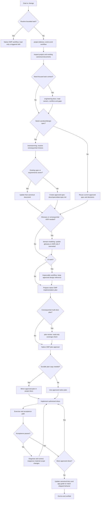

# omp-config

Portable snapshot of OMP user-level configuration and behavior, including model-role and agent-model assignments, agent definitions, rules, extensions, commands, MCP declarations, skill sources, watchdog configuration, and the disabled plugin lock state. The maintained settings intentionally preserve `tools.approvalMode: yolo`; review this unrestricted approval choice before installing.

## Requirements and scope

- POSIX: `sh`, `awk`, `dirname`, `mkdir`, `rm`, `cp`, `cmp`, `mktemp`, and `date`. Remote ZIP installation additionally requires `curl` and `unzip`.
- Windows: PowerShell 5.1+; remote ZIP installation uses `Invoke-WebRequest` and `Expand-Archive`.
- Installation validates an existing home directory and every mapped source and destination before writing. It does not prune unrelated files or directories. Changed regular files receive collision-safe sibling backups; byte-identical files are not rewritten.
- The portable files do not include OMP itself, model credentials, node, the OpenDesign daemon, RTK, or herdr services. `config/agent/mcp.json` expects `GITHUB_TOKEN` and `OMP_OPEN_DESIGN_CLI`; configure these per machine. The latter names an installed daemon CLI, not a bundled build. The optional RTK and herdr integrations are retained without enabling their services.
- `config/SKILL-SOURCES.md` documents the three captured skill roots and licensing caveat. Skills are snapshots, not a guarantee of downstream redistribution rights.

## Managed files

`config/files.tsv` is the explicit source-to-destination inventory used by both installers and doctors. It maps the regular files under `config/agent/` to `~/.omp/agent/`, `config/plugins/` to `~/.omp/plugins/`, `config/skills-agents/` to `~/.agents/skills/`, and `config/skills-agent/` to `~/.agent/skills/`. The inventory itself is source metadata and is not installed. It includes the three skill roots as separate destinations and preserves their configured discovery order and distinct copies.

Credentials, histories, databases, caches, `node_modules`, and generated state are excluded. The installer creates only directories needed for listed files; no unrelated destination data is copied, removed, or overwritten.

## Install and update

From a local clone on Linux/macOS:

```sh
sh install.sh --dry-run --home /path/to/existing-home
sh install.sh
sh install.sh --home '/path/with spaces'
```

Windows PowerShell:

```powershell
.\install.ps1 -DryRun
.\install.ps1
.\install.ps1 -Home 'C:\Users\example'
```

The home override selects the destination root; it must already exist. POSIX defaults to `$HOME`; PowerShell defaults to `%USERPROFILE%`. The scripts also accept `--source`/`-Source` with a local source directory or ZIP URL:

```sh
sh install.sh --source https://github.com/rizariaputrawira/omp-config/archive/refs/heads/main.zip
```

```powershell
.\install.ps1 -Source 'https://github.com/rizariaputrawira/omp-config/archive/refs/heads/main.zip'
```

Remote archives must contain exactly one top-level directory, including hidden entries. Dry-run reports intended changes but does not create destination directories, backups, or services.

The OpenDesign start/stop command guidance is user-invoked and POSIX-shell-specific. Set `OMP_OPEN_DESIGN_LAUNCHER` to an executable installed launcher before running those commands; Windows installation does not provide a native PowerShell equivalent. MCP additionally uses `OMP_OPEN_DESIGN_CLI` for the installed daemon CLI and `OD_DAEMON_URL=http://127.0.0.1:7456`; installation does not start the daemon or MCP server.

## Configuration doctor

Check is read-only and compares every inventory entry:

```sh
sh scripts/doctor.sh
sh scripts/doctor.sh --check --home /path/to/existing-home
sh scripts/doctor.sh --fix --home /path/to/existing-home
```

```powershell
.\scripts\doctor.ps1
.\scripts\doctor.ps1 -Check -Home 'C:\Users\example'
.\scripts\doctor.ps1 -Fix -Home 'C:\Users\example'
```

The doctor exits 0 only when every mapped file matches, 1 for missing or drifted files, and 2 for invalid arguments or unusable inventory/home/read/repair errors. Fix delegates to the platform installer once, then checks every file. Use `python3 scripts/test_install.py` to run the deterministic POSIX installer/doctor integration scenarios; the runner reports explicitly when no PowerShell runtime is available. Run `bun scripts/test_model_routing.mjs` to check the production extension's worker routing and workspace-tool boundaries.

## Documentation-driven engineering suite

The maintained suite is managed repository payload, not an OMP application patch. Normal installation deploys its 108 regular assets from `config/skills-agents/` to `.agents/skills/`; this cutover does not deploy into the actual installed home. The full inventory now has 372 mappings. Existing ten canonical destinations remain, avoiding obsolete discoverable aliases under the non-pruning installer.

Managed `config/agent/AGENTS.md` provides short conditional trigger-to-owner routing. Actual procedures are read on demand. Disabled/filtered/unavailable suite assets do not automatically reload or block ordinary OMP work. Requested unavailable suite-specific proof remains incomplete; native permissions and approval still govern. No new hook, router, service, task-state database, tracker, auto-commit, scanner or package install is required.

### Workflow at a glance



**Where the skills fit:** `project-delivery` owns the substantial-delivery path; `engineering-docs` supplies focused context when needed; `brainstorming` resolves consequential product choices; `domain-modeling` handles active terminology and consequential decisions; `plan-review` checks consequential multi-slice coverage before native approval. During implementation, use `tdd` only for requested test-first work, `diagnosing-bugs` for difficult/flaky/performance issues, and `code-review` for review. Use `security-intake` for external bundle adoption, `security-review` for focused security changes, and `security-audit` only for explicitly bounded audits. These do not all run on every app.

**Where documents fit:** reuse existing product/requirements/design owners first. Create or update an approved spec only when the app needs one; default new spec path is `docs/specs/YYYY-MM-DD-topic.md`. Glossaries and ADRs are conditional. A repository plan copy is optional for a real team/portability need, not a second approval authority. After verification, update the existing README or create `docs/app-guide.md` if none exists. Context packets and native todos are working aids, not extra product documents.

OMP owns operational state (native plan approval, optional todos, task workers and same-session resume); project documents remain the authority for requirements and decisions. Delegation is optional and only for independent work. Portable handoff is for an explicit pause/transfer; it is not native session resume or `/handoff` compaction. Native Plan Mode and approval behavior were not runtime-verified in this cutover.

| Canonical skill | Origin: our authorship and selected upstream influence | Concrete capability |
|---|---|---|
| engineering-docs | Originally authored by us in staging; selected GSD documentation mechanisms informed the managed adaptation | Sole documentation owner: eight actions, source-first reuse, typed manifest, seven-heading context, trace/document audit and upgrade limits |
| brainstorming | Our OMP-specific adaptation; selected Matt Pocock and Superpowers methods informed it | Approval paths, supplied-intent write-back and explicit ready-frontier stress-test |
| domain-modeling | Our OMP-specific adaptation of selected Matt Pocock methods | Active counterexamples, settled glossary and consequential truthful ADRs |
| tdd | Our OMP-specific adaptation of selected Matt Pocock and Superpowers methods | Meaningful observed vertical RED/GREEN and optional refactor; explicit test-first only |
| code-review | Our OMP-specific adaptation of selected Matt Pocock and Superpowers methods | Separate Standards/correctness and Spec verdicts, WIP coverage and complete fix dispositions |
| diagnosing-bugs | Our OMP-specific adaptation of selected Matt Pocock and Superpowers methods | Signal/minimization/falsifiable hypothesis/root correction/original-path proof |
| writing-for-agents | Our OMP-specific adaptation of selected Matt Pocock and Superpowers methods | Condition-bearing pointers, single owners and authorized real baseline/candidate assessment |
| project-delivery | Our delivery procedure and ownership/resumption rules; selected Matt Pocock, Superpowers and GSD methods informed it | Complete vertical delivery and independently authorized resume; incumbent-first UI evidence |
| plan-review | Our OMP-specific review procedure; selected GSD methods informed it | Read-only semantic acceptance, consumer integration, dependencies and proof coverage check |
| handoff-to-another-harness | Our portable handoff contract; selected GSD methods informed it | Explicit pause/export and transfer, exact partial state and non-authoritative portable snapshot |
| resume-from-handoff | Our read-only loading procedure; selected GSD methods informed it | Selected-snapshot summary only, never continuation |
| retro | Our recommendation-only procedure; selected GSD learning methods informed it | Evidence/applicability/promotion conditions; no automatic policy/memory mutation |
| security-intake | Our OMP intake procedure; selected NVIDIA SkillSpector methods informed it | Source-only bundle purpose/authority/provenance/coverage assessment, exact four verdicts |
| security-review | Our OMP review procedure; selected Anthropic review methods informed it | Focused changed-boundary discovery and fresh source refutation |
| security-audit | Our bounded audit procedure; selected Cloudflare methods informed it | Coverage-led audit with relevant AI, availability and supply-chain companions |

Exact immutable revisions, local path mappings, modifications and full MIT/Apache-2.0 notices are in each skill's SOURCES.md and [payload provenance](config/SKILL-SOURCES.md). Titus assets are not copied or translated because no covering grant was established. The Pi catalog shortlist (bigpowers 2.88.9, pi-security-analysis 0.17.3, pi-subagents 0.75.0, openwiki 0.7.0) is rejected for this bounded need, not certified safe/unsafe or assumed OMP-compatible. Its recorded necessity assessment is in engineering-docs/SOURCES.md.

Removed upstream behavior includes universal TDD, forced agents/model tiers, auto-commits/worktrees/ticket publishing, tracker/Context7/state engines, provider-specific tool aliases, fixed retry/confidence gates, fail-open filtering and universal security exclusions. OpenDesign is required only for explicitly required generation/refinement, not ordinary approved incumbent UI work. Existing independently owned UI routing remains.

### Security result and continuation boundaries

The security-reviewer retains its exact read-only tool list, `spawns: []` and `model: "@task"`. Its single native-style contract now requires coverage_summary, reviewed_paths and deferred, with candidates/decisions replacing findings/confidence. Discovery never assigns confirmation/severity; fresh refutation accounts for every assigned current root cause. Missing terminal arrays, IDs, independent proof, conditional confirmation fields or effective dispatched-definition provenance leaves the assessment incomplete. A role name, model identity or task-supplied schema alone is not managed-definition provenance. Read-only procedure/tool names are not OS isolation.

Handoff loading reads only its selected snapshot. Actual continuation belongs to project-delivery resume, reconciling canonical sources and exact approved bytes/scope with independently available trusted authorization. A mirror/hash/handoff label alone never authorizes execution. Export under read-only/Plan Mode returns unwritten proposed content.

### Compatibility evidence and upgrades

Public `omp --version` and `omp --help` observed installed **18.5.0**. Help exposes `--config`, explicit file input and `--no-skills`. The user-invoked `omp --no-skills` disables skill discovery/loading, not AGENTS guidance, custom agents, tools or approval/model state. Conditional routing honors disablement and does not file-load around it. Recheck installed help before using that flag after an upgrade.

Payload/deployment, native discovery/task/custom-agent selection, and real tool-enabled behavior are independent checks. Current source parsing is not native dispatch proof; published moving documentation is not installed-version acceptance. Public `omp read skill://<name>` resolved all fifteen deployed entrypoints in a disposable HOME/state, and an audit companion reference resolved there too. These are passive URI reads, not authenticated task/agent selection. Corrected fresh CLI generation with closed stdin exited 1 because no provider API key was available; the earlier piped-stdin attempt timed out. That startup also attempted the existing GitHub/OpenDesign MCP connections, which failed; it did not verify those services. Active credentials were not read or copied. At the user's request, the separate CLI-authentication item is closed using the already exercised authenticated current-session host actions and their actual model/tool/result evidence. This is an accepted verification path, not a passing fresh CLI generation result. Effective managed security-definition selection, native Plan Mode, malformed/overridden selection and disabled/unavailable native task cases remain unverified compatibility notes, not claimed passes or current blockers.

The user's deployment platform is WSL. POSIX installer/doctor verification is complete; Windows/PowerShell verification is closed as out of scope for this WSL-only acceptance. Neither PowerShell runtime was available, and no Windows execution is claimed. Verify the PowerShell entrypoints on an actual supported platform only if Windows deployment is later requested.

The old staging 13-smoke/ALL51/frozen test epoch is historical and does not accept this fifteen-skill suite. Recovery copies and assessment fixtures are external session evidence, never installed payload. Runtime settings, PERSONALITY.md, the boundary hook, installers/doctors and unrelated snapshots remain outside this cutover.

### Cutover verification results

The production POSIX integration runner passed all 372 inventory entries; the unchanged model-routing runner passed its five named cases. Real disposable-home dry-run/install/doctor/repeat-install checks exercised source byte equality, zero dry-run mutation and repeat-install mtime/backup preservation. Metadata checks parsed all fifteen entrypoints using native Bun YAML, checked explicit asset/link coverage and full pinned notices, and checked all 129 frozen concept reference/template targets and heading anchors. One adopted security heading was corrected to retain its original frozen catalog target; the registry and seven templates were not changed.

The following are actual source-loaded private normal-host actions, not native registration, security-role selection or OS-containment proof. Completed implementation and assessment workers' runtime records show `openai-codex/gpt-6.1-sol`, High thinking and no fallback. Parent-owned process evidence is separate from workers' source observations.

The remaining verification was resumed with fresh Sol High actors, and a fresh independent reader judged all eighteen predefined smoke purposes supported with the stated bounds. This is bounded current-session acceptance, not a guarantee of every skill branch, exclusively candidate-caused behavior or unknown future-runtime compatibility. Matching runtime bootstrap guidance was also loaded in some actions: ponytail for coding, installed retro before the explicit copied retrospective procedure, and code-review for the independent evidence judge. Actual candidate procedures/references were separately read; these context qualifications are retained rather than claiming complete context isolation.

| Required behavior | Observed outcome and limits |
|---|---|
| CLI documentation setup and fresh rerun | Existing README and unrelated manifest owner preserved; typed manifest checked; fresh rerun made no changes. |
| Conflicting web authorization context and documentation audit | Both read-only actions retained competing owners, obsolete boundary, missing threat/operations evidence and unsupported remediation. Context supplied all seven headings; no severity invented. |
| Incomplete multi-slice plan | Read-only review identified omitted guest denial and missing CLI/API consumer integration with exact anchors. |
| Brainstorming stress-test | Inspected repository policy before asking the remaining ready refund choice; no implementation or documentation writes. |
| Active domain modeling | Used expiry/payment/cardinality counterexamples and settled glossary proposal; consequential ADR remained proposed, not falsely accepted. |
| Explicit TDD and ordinary-regression control | Observed two meaningful assertion failures before one combined correction/GREEN, then both passed; the test source was unchanged. Actual CLI success/denial paths passed. Separate ordinary request authored five passing regression cases without invoking TDD. Literal one-test-at-a-time RED/GREEN sequencing was not exercised and is not claimed. |
| WIP and fix review | Read actual WIP source, retained unknown Spec axis; fresh fix review addressed the original tenant issue and found newly introduced ordering breakage, read-only. |
| Reported CLI failure diagnosis | Treated report as ground truth; working-library discriminator isolated consumer bypass. Corrected only consumer, exercised exact permitted/denied CLI and passed three consumer regressions; no confirmation-only replay. |
| Normal two-slice delivery | Read all six delivery references, mapped acceptance to producer/consumer proof and independently dispositioned supplied feedback. Waited for actual library proof before consumer implementation; actual CLI paths then passed. Incomplete worker report was not accepted as evidence. |
| Guidance baseline/candidate assessment | Separate actual authors and fresh consumers preserved the existing owner and followed conditional pointers. Both controls succeeded; no invented baseline failure or improvement. Parent checked writes, source preservation and actual CLI behavior. A fresh independent reader inspected actual source/tool/result evidence and supported the bounded comparison; no comparative improvement or negative-trigger comparison is inferred. |
| Pause/export and read-only export control | New numeric snapshot preserved the previous one, contained the exact six headings and honest partial state; receiving prompt reconciled current authority. Separate control returned unwritten content with no writes. Native Plan Mode remains unverified. |
| Load-only handoff | Read only entrypoint, directory and selected snapshot; did not inspect cited sources or execute its “already approved” instructions. |
| Supported versus unsupported continuation authority | Current exact-scope parent assignment supported ordered reconstruction and CLI-only continuation; producer/snapshot preserved and actual CLI paths passed. A fresh unsupported-assertion action returned all seven headings, treated mirror/hash/handoff as content rather than permission, withheld continuation and left the fixture unchanged. The earlier quota-failed job remains historical failure, not merged proof. |
| Retrospective | Fresh action read the copied procedure/reference and real completed-slice process/test receipts, produced evidence/applicability/revisit conditions and rejected the unsupported universal wiki lesson; no policy/memory mutation. Matching installed-retro bootstrap was also read, so the actor's exclusive-copied-source wording is qualified externally; no recurrence or candidate-only attribution is claimed. |
| External bundle intake | Actual read-only discovery inventoried inert text/manifest and reported unsafe purpose/authority mismatch with missing binary/extension coverage. The earlier quota failure and a resumed refuter's nonmatching installed-code-review read remain recorded failures. A distinct fresh recheck loaded copied intake first, independently inventoried/read current sources and returned the same assigned root as needs-validation without severity; fixture unchanged and no target execution/install/network/credential/write/delegation attempt. Unsafe adoption posture is not a confirmed runtime exploit. |
| Focused tenant-gate review/refutation | Actual read-only discovery and distinct fresh refuter independently read imported gate; seeded gate-removal allegation rejected on complete scoped source disproof, no severity. Runtime/native-definition assurance remains unverified. |
| Explicit partial security audit | Discovery plus distinct fresh refutation/coverage challenge considered AI, availability and supply-chain boundaries. Local authorization omission retained as needs-validation because caller/deployment/model facts are missing; no severity or whole-app assurance. |
| Malformed/lifecycle-invalid terminal results | Fresh semantic action read all nine invalid cases and accounted for each exactly once. Missing phase arrays/IDs, conflicting or unassigned dispositions, missing confirmation proof, unproved authorized-local, prohibited severity and failed fragments all withheld confirmation/clean assurance, retaining assigned unresolved IDs. This is observed source-loaded semantic assessment, not production native-parser validation. |

Complete published host security terminals were checked for assigned IDs, phase completeness and semantic dispositions; a task-supplied schema and same-named role still do not prove effective managed-definition provenance. Failed/intermediate yields and a schema-validation override in the fresh intake trace are retained, not promoted to native strict-enforcement proof; acceptance uses its complete final source-grounded terminal. Security runtime impact and native-definition assurance remain incomplete where facts are unavailable. Failed actors are not reconstructed from fragments, replaced with weaker models or counted as clean results. The user's requested current-session/WSL verification is complete with these notes; unrun native and Windows interfaces remain unverified, not falsely passed or current delivery blockers.
